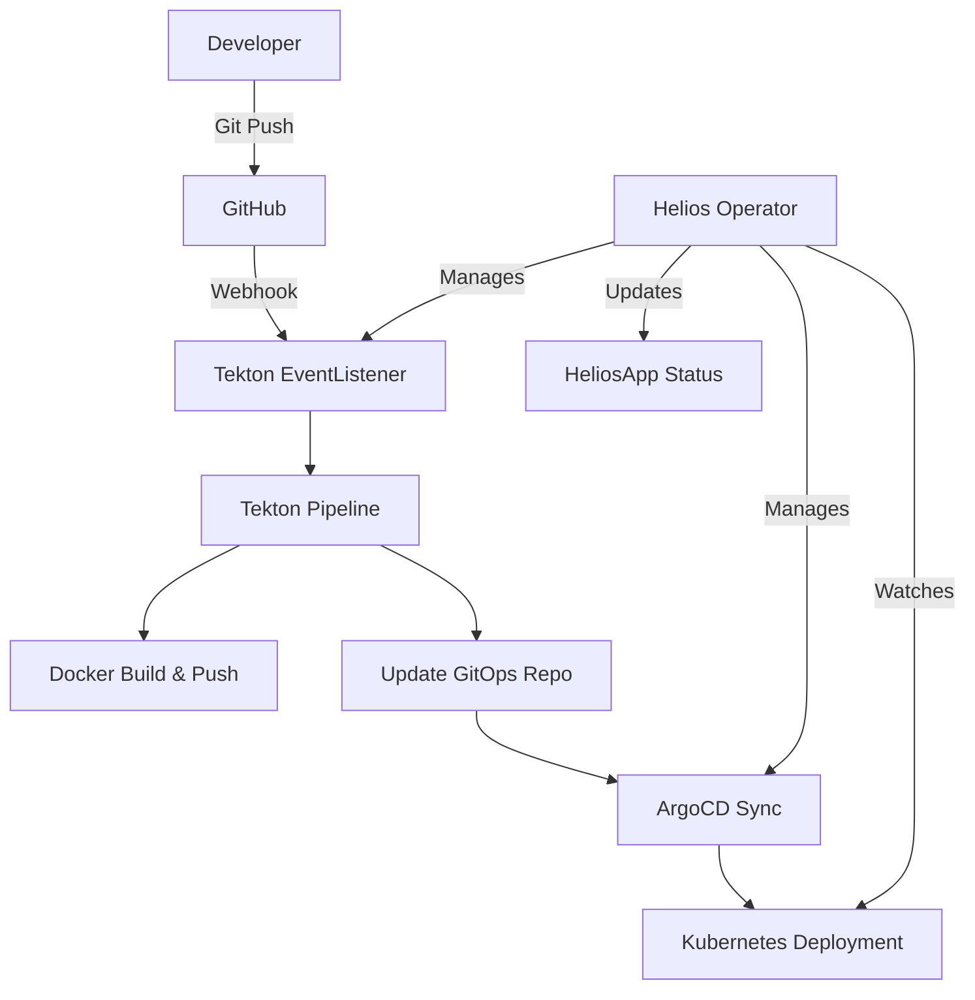

# 🚀 Helios Operator

> **Zero-Configuration GitOps Deployment for Kubernetes Applications**

[](LICENSE)
[](go.mod)
[](go.mod)
[](https://github.com/hoangphuc841/helios-operator/actions)
[](https://codecov.io/gh/hoangphuc841/helios-operator)
[](https://github.com/hoangphuc841/helios-operator/releases)

Helios Operator is a Kubernetes operator that automates the complete application lifecycle from source code to production deployment using **Tekton Pipelines** and **ArgoCD**. Simply define your application once, and Helios handles the rest.

## ✨ **Why Helios?**

- 🎯 **Zero Configuration** - No need to know Tekton or ArgoCD internals
- 🔄 **Automatic Pipeline Generation** - Pipelines created from templates
- 📊 **Real-time Status Updates** - Kubernetes Watches for instant feedback
- 🛡️ **Production Ready** - Built-in security, monitoring, and best practices
- 🚀 **GitOps Native** - Pure GitOps workflow with ArgoCD

## 🎬 **Quick Start (5 minutes)**

### 1. Install Prerequisites

```bash
# Install Tekton Pipelines
kubectl apply -f https://storage.googleapis.com/tekton-releases/pipeline/latest/release.yaml

# Install ArgoCD
kubectl create namespace argocd
kubectl apply -n argocd -f https://raw.githubusercontent.com/argoproj/argo-cd/stable/manifests/install.yaml
```

### 2. Install Helios Operator

```bash
# Install via Helm
helm repo add helios-operator https://hoangphuc841.github.io/helios-operator
helm install helios-operator helios-operator/helios-operator

# Or install via kubectl
kubectl apply -f https://raw.githubusercontent.com/hoangphuc841/helios-operator/main/config/default/kustomization.yaml
```

### 3. Create Your First Application

```yaml
apiVersion: platform.helios.io/v1
kind: HeliosApp
metadata:
  name: my-awesome-app
  namespace: default
spec:
  gitRepo: "https://github.com/your-org/your-app.git"
  imageRepo: "docker.io/your-org/my-awesome-app"
  port: 80
  replicas: 1
  serviceAccount: "pipeline-sa"
  webhookSecret: "github-webhook-secret"
  pvcName: "my-awesome-app-pvc"
```

### 3. Watch the Magic Happen ✨

```bash
# Check your application status
kubectl get heliosapp my-awesome-app

# Watch the operator create resources
kubectl get pipelines,eventlisteners,applications -A
```

**That's it!** Helios automatically:

- ✅ Creates Tekton Pipeline (`my-awesome-app-pipeline`)
- ✅ Sets up webhook triggers for Git events
- ✅ Creates ArgoCD Application for GitOps deployment
- ✅ Provides real-time status updates

## 🌟 **Key Features**

### 🎯 Zero-Configuration Pipeline Creation

No more manual Pipeline management. Helios automatically generates Tekton Pipelines from templates based on your application name.

### 🔄 Real-time Status Updates

Built-in Kubernetes Watches provide instant feedback on:

- ArgoCD Application sync status
- Tekton PipelineRun build progress
- Kubernetes Deployment health

### 🛡️ Production-Ready Security

- Pod Security Standards compliance
- RBAC with least privilege access
- Webhook validation for resource integrity
- Structured logging with context

### 📊 Comprehensive Monitoring

- Prometheus metrics integration
- ServiceMonitor support
- Custom metrics for build success rates
- Deployment health tracking

## 📚 **Documentation**

### 👥 **For Users**

- **[Getting Started Guide](docs/user-guide/01-getting-started.md)** - Complete setup and first application
- **[HeliosApp Reference](docs/user-guide/02-helios-app-spec.md)** - Detailed spec explanation
- **[Troubleshooting](docs/user-guide/03-troubleshooting.md)** - Common issues and solutions

### 👨‍💻 **For Developers**

- **[Architecture Overview](docs/developer-guide/01-architecture.md)** - System design and components
- **[Development Setup](docs/developer-guide/02-development-setup.md)** - Local development environment
- **[Testing Guide](docs/developer-guide/03-testing.md)** - Unit, integration, and E2E tests

### 📖 **Reference**

- **[Helm Chart Values](docs/reference/helm-chart-values.md)** - Complete configuration reference
- **[Prometheus Metrics](docs/reference/prometheus-metrics.md)** - Available metrics and monitoring

**[📋 Full Documentation Index](docs/index.md)**

## 🏗️ **Architecture**



## 🚀 **Production Deployment**

### High Availability Setup

```bash
helm install helios-operator helios-operator/helios-operator \
  --set replicaCount=3 \
  --set podDisruptionBudget.enabled=true \
  --set metrics.serviceMonitor.enabled=true
```

### Custom Configuration

```bash
helm install helios-operator helios-operator/helios-operator \
  --set image.tag=latest \
  --set features.autoPipelineGeneration=true \
  --set webhook.enabled=true
```

## 🤝 **Contributing**

We welcome contributions! Please see our [Contributing Guide](CONTRIBUTING.md) for details.

### Development Quick Start

```bash
# Clone the repository
git clone https://github.com/hoangphuc841/helios-operator.git
cd helios-operator

# Run tests
make test

# Build and deploy locally
make docker-build IMG=helios-operator:latest
make deploy IMG=helios-operator:latest
```

## 📄 **License**

This project is licensed under the Apache License 2.0 - see the [LICENSE](LICENSE) file for details.

## 🙏 **Acknowledgments**

- [Kubebuilder](https://kubebuilder.io/) - Kubernetes controller framework
- [Tekton](https://tekton.dev/) - Kubernetes-native CI/CD
- [ArgoCD](https://argoproj.github.io/cd/) - Declarative GitOps CD

---

**Ready to deploy?** Start with our [Getting Started Guide](docs/user-guide/01-getting-started.md) 🚀
