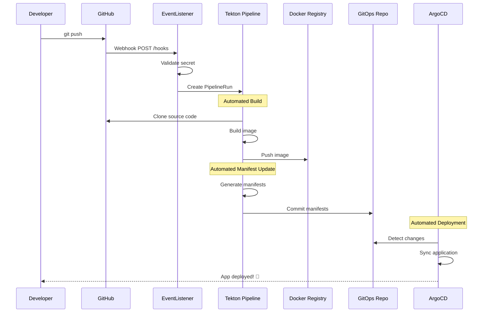
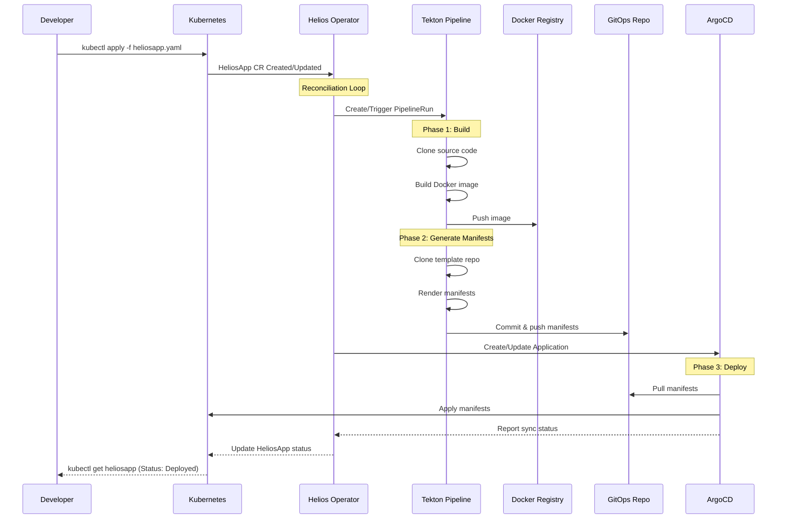

# Getting Started with Helios Operator

Complete end-to-end guide to deploy your application using Helios Operator with full GitOps workflow.

## 🎯 What You'll Achieve

By the end of this guide, you will:

1. ✅ Have a working Kubernetes cluster with Helios Operator
2. ✅ Deploy your application by pushing code to GitHub
3. ✅ See automatic manifest generation via Tekton Pipeline
4. ✅ Watch ArgoCD automatically deploy your application
5. ✅ Understand the complete GitOps workflow

## 📋 Prerequisites

### Required Software

- **Kubernetes cluster** (v1.19+) - Minikube, Kind, K3s, or cloud cluster
- **kubectl** (v1.19+)
- **Git** and GitHub account
- **Docker Hub account** (or any container registry)

### Required GitHub Repositories

You'll need **3 repositories** (can be public or private):

1. **Application Source Code Repo** - Your actual application code

   - Example: `https://github.com/YOUR_USERNAME/my-nodejs-app`
   - Must contain: `Dockerfile`

2. **GitOps Manifests Repo** - Where rendered Kubernetes manifests are stored

   - Example: `https://github.com/YOUR_USERNAME/gitops-manifests`
   - Can be empty initially (will be populated automatically)

3. **App Templates Repo** (Optional) - Kubernetes manifest templates
   - Example: `https://github.com/YOUR_USERNAME/k8s-templates`
   - Or use existing template repos

### Development (Optional)

- Go 1.21+
- Make

---

## 🚀 Step-by-Step Setup

### Step 0: Prepare Your GitHub Repositories

Before starting, create these repositories on GitHub:

#### 0.1. Create Application Repo

```bash
# Create a simple Node.js app example
mkdir my-nodejs-app && cd my-nodejs-app
git init

# Create app code
cat > index.js << 'EOF'
const express = require('express');
const app = express();
const PORT = process.env.PORT || 8080;

app.get('/', (req, res) => {
  res.json({
    message: 'Hello from Helios!',
    version: process.env.VERSION || 'v1.0.0',
    timestamp: new Date().toISOString()
  });
});

app.get('/health', (req, res) => {
  res.json({ status: 'healthy' });
});

app.listen(PORT, () => {
  console.log(`Server running on port ${PORT}`);
});
EOF

# Create package.json
cat > package.json << 'EOF'
{
  "name": "my-nodejs-app",
  "version": "1.0.0",
  "main": "index.js",
  "dependencies": {
    "express": "^4.18.2"
  },
  "scripts": {
    "start": "node index.js"
  }
}
EOF

# Create Dockerfile
cat > Dockerfile << 'EOF'
FROM node:18-alpine
WORKDIR /app
COPY package*.json ./
RUN npm install --production
COPY . .
EXPOSE 8080
CMD ["npm", "start"]
EOF

# Push to GitHub
git add .
git commit -m "Initial commit"
git branch -M main
git remote add origin https://github.com/YOUR_USERNAME/my-nodejs-app.git
git push -u origin main
```

#### 0.2. Create GitOps Manifests Repo

```bash
# Create empty GitOps repo
mkdir gitops-manifests && cd gitops-manifests
git init

# Create base structure
mkdir -p apps/dev apps/staging apps/production

# Create main README
cat > README.md << 'EOF'
# GitOps Manifests Repository

# Create .gitkeep files to track empty directories
touch apps/dev/.gitkeep
touch apps/staging/.gitkeep
touch apps/production/.gitkeep

# Commit everything
git add .
git commit -m "Initial structure with environment documentation"
git branch -M main
git remote add origin https://github.com/YOUR_USERNAME/gitops-manifests.git
git push -u origin main
```

#### 0.3. Create App Templates Repo (Optional)

```bash
mkdir k8s-templates && cd k8s-templates
git init
mkdir -p templates/simple-app

# Create basic Kubernetes template
cat > templates/simple-app/deployment.yaml << 'EOF'
apiVersion: apps/v1
kind: Deployment
metadata:
  name: {{ .AppName }}
  namespace: {{ .Namespace }}
spec:
  replicas: {{ .Replicas }}
  selector:
    matchLabels:
      app: {{ .AppName }}
  template:
    metadata:
      labels:
        app: {{ .AppName }}
    spec:
      containers:
      - name: app
        image: {{ .ImageRepo }}:{{ .ImageTag }}
        ports:
        - containerPort: {{ .Port }}
        env:
        - name: VERSION
          value: "{{ .ImageTag }}"
---
apiVersion: v1
kind: Service
metadata:
  name: {{ .AppName }}
  namespace: {{ .Namespace }}
spec:
  selector:
    app: {{ .AppName }}
  ports:
  - port: 80
    targetPort: {{ .Port }}
  type: ClusterIP
EOF

git add .
git commit -m "Add simple app template"
git branch -M main
git remote add origin https://github.com/YOUR_USERNAME/k8s-templates.git
git push -u origin main
```

---

### Step 1: Install Kubernetes Cluster (if needed)

If you don't have a cluster, install Minikube:

```bash
# Install Minikube (Linux)
curl -LO https://storage.googleapis.com/minikube/releases/latest/minikube-linux-amd64
sudo install minikube-linux-amd64 /usr/local/bin/minikube

# Start cluster with enough resources
minikube start --cpus=4 --memory=8192 --kubernetes-version=v1.27.0

# Verify
kubectl get nodes
```

Or use Kind:

```bash
# Install Kind
curl -Lo ./kind https://kind.sigs.k8s.io/dl/v0.20.0/kind-linux-amd64
chmod +x ./kind
sudo mv ./kind /usr/local/bin/kind

# Create cluster
kind create cluster --name helios-cluster

# Verify
kubectl cluster-info
```

---

### Step 2: Install Dependencies

#### 2.1. Install Tekton Pipelines

```bash
kubectl apply -f https://storage.googleapis.com/tekton-releases/pipeline/latest/release.yaml
```

Wait for pods to be ready:

```bash
kubectl wait --for=condition=ready pod -l app=tekton-pipelines-controller -n tekton-pipelines --timeout=90s
kubectl get pods -n tekton-pipelines
```

#### 2.2. Install Tekton Triggers

```bash
kubectl apply -f https://storage.googleapis.com/tekton-releases/triggers/latest/release.yaml
kubectl apply -f https://storage.googleapis.com/tekton-releases/triggers/latest/interceptors.yaml
```

Verify:

```bash
kubectl get pods -n tekton-pipelines | grep trigger
```

#### 2.3. Install ArgoCD

```bash
# Create namespace
kubectl create namespace argocd

# Install ArgoCD
kubectl apply -n argocd -f https://raw.githubusercontent.com/argoproj/argo-cd/stable/manifests/install.yaml

# Wait for pods
kubectl wait --for=condition=ready pod -l app.kubernetes.io/name=argocd-server -n argocd --timeout=180s
```

Verify and access ArgoCD UI:

```bash
# Get admin password
kubectl -n argocd get secret argocd-initial-admin-secret -o jsonpath="{.data.password}" | base64 -d
echo ""

# Port forward to access UI
kubectl port-forward svc/argocd-server -n argocd 8080:443

# Access at: https://localhost:8080
# Username: admin
# Password: (from command above)
```

---

### Step 3: Install Helios Operator

#### 3.1. Clone the Helios Operator Repository

```bash
git clone https://github.com/YOUR_ORG/helios-operator
cd helios-operator
```

#### 3.2. Install CRD and Deploy Operator

```bash
# Install Custom Resource Definition
make install

# Deploy the operator (development mode)
make deploy IMG=controller:latest

# Or build and load into cluster (for Minikube/Kind)
make docker-build IMG=helios-operator:latest
minikube image load helios-operator:latest  # For minikube
kind load docker-image helios-operator:latest --name helios-cluster  # For kind

make deploy IMG=helios-operator:latest
```

Verify operator is running:

```bash
kubectl get pods -n helios-operator-system
kubectl logs -n helios-operator-system deployment/helios-operator-controller-manager -f
```

Check CRD is installed:

```bash
kubectl get crd heliosapps.platform.helios.io
```

---

### Step 4: Setup Tekton Pipeline Resources

#### 4.1. Create Persistent Volume for Workspace

```bash
kubectl apply -f tekton/workspace-pvc.yaml
```

Verify:

```bash
kubectl get pvc shared-workspace-pvc
```

#### 4.2. Install Tekton Tasks

```bash
# Install all tasks
kubectl apply -f tekton/task-git-clone.yaml
kubectl apply -f tekton/task-kanako-build.yaml
kubectl apply -f tekton/task-git-update-manifest.yaml

# Verify
kubectl get task
```

#### 4.3. Install Pipeline

```bash
kubectl apply -f tekton/pipeline.yaml

# Verify
kubectl get pipeline from-code-to-cluster
```

---

### Step 5: Setup Credentials and Service Account

#### 5.1. Create Docker Hub Credentials

```bash
# Create docker credentials secret
kubectl create secret generic docker-credentials \
  --from-literal=username=YOUR_DOCKERHUB_USERNAME \
  --from-literal=password=YOUR_DOCKERHUB_TOKEN

# Or use docker config
kubectl create secret generic docker-credentials \
  --from-file=.dockerconfigjson=$HOME/.docker/config.json \
  --type=kubernetes.io/dockerconfigjson
```

**To get Docker Hub token:**

1. Go to https://hub.docker.com/settings/security
2. Click "New Access Token"
3. Give it a name and generate
4. Save the token

#### 5.2. Create GitHub SSH Credentials

For private repositories or for git push operations:

```bash
# Generate SSH key if you don't have one
ssh-keygen -t ed25519 -C "your_email@example.com" -f ~/.ssh/helios_rsa -N ""

# Add to GitHub
# 1. Copy public key
cat ~/.ssh/helios_rsa.pub
# 2. Go to GitHub Settings > SSH and GPG keys > New SSH key
# 3. Paste and save

# Create Kubernetes secret
kubectl create secret generic git-credentials \
  --from-file=ssh-privatekey=$HOME/.ssh/helios_rsa \
  --from-file=known_hosts=$HOME/.ssh/known_hosts \
  --type=kubernetes.io/ssh-auth

# Annotate for Tekton (for each Git host you use)
kubectl annotate secret git-credentials tekton.dev/git-0=github.com
```

**For HTTPS with Personal Access Token:**

```bash
# Create GitHub Personal Access Token
# Go to: GitHub Settings > Developer settings > Personal access tokens > Tokens (classic)
# Click "Generate new token" with repo permissions

kubectl create secret generic git-credentials \
  --from-literal=username=YOUR_GITHUB_USERNAME \
  --from-literal=password=YOUR_GITHUB_TOKEN \
  --type=kubernetes.io/basic-auth

kubectl annotate secret git-credentials tekton.dev/git-0=https://github.com
```

#### 5.3. Create GitHub Webhook Secret

This secret will be used by Tekton Triggers to validate webhook requests from GitHub:

```bash
# Create a random webhook secret
kubectl create secret generic github-webhook-secret \
  --from-literal=secretToken=$(openssl rand -base64 32)

# Or use your own secret value
kubectl create secret generic github-webhook-secret \
  --from-literal=secretToken="YOUR_WEBHOOK_SECRET"
```

Verify:

```bash
kubectl get secret github-webhook-secret
```

**Note:** If you plan to set up GitHub webhooks later, save this secret value. You'll need it when configuring the webhook in GitHub repository settings.

To retrieve the secret value later:

```bash
kubectl get secret github-webhook-secret -o jsonpath='{.data.secretToken}' | base64 -d
echo ""
```

#### 5.4. Create Service Account

```bash
kubectl apply -f tekton/service-account.yaml
```

Verify:

```bash
kubectl get sa pipeline-sa
kubectl describe sa pipeline-sa
```

---

### Step 6: Deploy Your First Application with Helios

Now the exciting part - deploy your application!

#### 6.1. Prepare Your HeliosApp Configuration

Create `my-app.yaml` with your actual repository URLs:

```yaml
apiVersion: platform.helios.io/v1
kind: HeliosApp
metadata:
  name: my-nodejs-app
  namespace: default
spec:
  # ===== Your Application Source Code =====
  gitRepo: "https://github.com/YOUR_USERNAME/my-nodejs-app"
  gitBranch: "main"

  # ===== Container Image =====
  imageRepo: "YOUR_DOCKERHUB_USERNAME/my-nodejs-app"

  # ===== Application Settings =====
  port: 8080
  replicas: 2

  # ===== CI/CD Pipeline =====
  pipelineName: "from-code-to-cluster"
  serviceAccount: "pipeline-sa"
  webhookSecret: "github-webhook-secret"
  pvcName: "shared-workspace-pvc"

  # ===== GitOps Template (optional - use default or custom) =====
  templateRepo: "https://github.com/YOUR_USERNAME/k8s-templates"
  templatePath: "templates/simple-app"

  # ===== GitOps Destination =====
  gitopsRepo: "git@github.com:YOUR_USERNAME/gitops-manifests.git"
  gitopsPath: "apps/dev/my-nodejs-app"

  # ===== Custom Values =====
  values:
    environment: "dev"
    replicaCount: "2"
    imageTag: "latest"
```

**Important:** Replace these placeholders:

- `YOUR_USERNAME` - Your GitHub username
- `YOUR_DOCKERHUB_USERNAME` - Your Docker Hub username

#### 6.2. Apply the HeliosApp

```bash
kubectl apply -f my-app.yaml
```

#### 6.3. Watch the Magic Happen!

**Terminal 1 - Watch HeliosApp status:**

```bash
kubectl get heliosapp my-nodejs-app -w
```

**Terminal 2 - Watch PipelineRuns:**

```bash
kubectl get pipelinerun -l heliosapp=my-nodejs-app -w
```

**Terminal 3 - Watch ArgoCD Applications:**

```bash
kubectl get application -n argocd -w
```

#### 6.4. Monitor Pipeline Execution

```bash
# List all pipeline runs
kubectl get pipelinerun

# Get detailed status
kubectl describe pipelinerun <pipelinerun-name>

# View logs (requires tkn CLI)
tkn pipelinerun logs <pipelinerun-name> -f

# Or use kubectl
kubectl logs -l tekton.dev/pipelineRun=<pipelinerun-name> --all-containers=true -f
```

#### 6.5. Check ArgoCD Application

```bash
# Check if ArgoCD app was created
kubectl get application -n argocd my-nodejs-app

# Get sync status
kubectl get application -n argocd my-nodejs-app -o jsonpath='{.status.sync.status}'

# Get health status
kubectl get application -n argocd my-nodejs-app -o jsonpath='{.status.health.status}'
```

#### 6.6. Verify Deployment

```bash
# Check pods
kubectl get pods -l app=my-nodejs-app

# Check service
kubectl get svc my-nodejs-app

# Test the application
kubectl port-forward svc/my-nodejs-app 3000:80

# In another terminal
curl http://localhost:3000
```

---

### Step 7: Setup GitHub Webhooks (Optional - for Auto-trigger on Push)

**⚠️ Important:** Set up webhooks **BEFORE** pushing code changes if you want automatic pipeline triggering!

This step allows automatic pipeline triggering when you push code to GitHub, instead of manually updating the HeliosApp.

#### 7.1. Expose Tekton EventListener

First, you need to expose the Tekton EventListener service so GitHub can reach it:

**Option A: Using ngrok (for testing/development):**

```bash
# Install ngrok (if not installed)
# Download from https://ngrok.com/download

# Expose the EventListener service
kubectl port-forward -n default svc/el-helios-listener 8080:8080 &

# In another terminal, create tunnel
ngrok http 8080
```

Copy the HTTPS URL provided by ngrok (e.g., `https://abc123.ngrok.io`)

**Option B: Using LoadBalancer (for cloud clusters):**

```bash
# Patch the service to use LoadBalancer
kubectl patch svc el-helios-listener -p '{"spec": {"type": "LoadBalancer"}}'

# Get the external IP
kubectl get svc el-helios-listener
# Wait for EXTERNAL-IP to be assigned
```

**Option C: Using Ingress (recommended for production):**

```yaml
# Create ingress.yaml
cat > webhook-ingress.yaml << 'EOF'
apiVersion: networking.k8s.io/v1
kind: Ingress
metadata:
  name: tekton-webhook-ingress
  namespace: default
  annotations:
    cert-manager.io/cluster-issuer: letsencrypt-prod  # If using cert-manager
spec:
  ingressClassName: nginx
  rules:
  - host: webhook.yourdomain.com
    http:
      paths:
      - path: /
        pathType: Prefix
        backend:
          service:
            name: el-helios-listener
            port:
              number: 8080
  tls:
  - hosts:
    - webhook.yourdomain.com
    secretName: webhook-tls
EOF

kubectl apply -f webhook-ingress.yaml
```

#### 7.2. Get Your Webhook Secret

Retrieve the webhook secret token you created earlier:

```bash
# Get the secret token
WEBHOOK_SECRET=$(kubectl get secret github-webhook-secret -o jsonpath='{.data.secretToken}' | base64 -d)
echo "Your webhook secret: $WEBHOOK_SECRET"

# Copy this value - you'll need it for GitHub
```

#### 7.3. Configure GitHub Webhook

Now go to your **application source code repository** on GitHub:

1. **Navigate to Repository Settings:**

   - Go to `https://github.com/YOUR_USERNAME/my-nodejs-app`
   - Click on **Settings** tab
   - Click on **Webhooks** in the left sidebar
   - Click **Add webhook** button

2. **Fill in the Webhook Form:**

   **Payload URL:**

   ```
   https://YOUR_EXPOSED_URL/hooks
   ```

   Examples:

   - ngrok: `https://abc123.ngrok.io/hooks`
   - LoadBalancer: `http://EXTERNAL_IP:8080/hooks`
   - Ingress: `https://webhook.yourdomain.com/hooks`

   **Content type:**

   ```
   application/json
   ```

   (Select from dropdown)

   **Secret:**

   ```
   [Paste the WEBHOOK_SECRET value from step 7.2]
   ```

   **SSL verification:**

   - ✅ **Enable SSL verification** (if using HTTPS with valid cert)
   - ⚠️ **Disable SSL verification** (only for testing with ngrok/self-signed certs)

   **Which events would you like to trigger this webhook?**

   - Select: **Just the push event**
   - Or select: **Let me select individual events** and check:
     - ✅ Pushes
     - ✅ Pull requests (optional, if you want to trigger on PRs)

   **Active:**

   - ✅ Check this box

3. **Click "Add webhook"**

#### 7.4. Verify Webhook Configuration

Test the webhook without making code changes:

```bash
# Check EventListener is ready
kubectl get pods -l eventlistener=helios-listener
kubectl get svc el-helios-listener

# View EventListener logs
kubectl logs -l eventlistener=helios-listener -f
```

Go to GitHub webhook settings and check:

- Recent Deliveries section should show "Ping" event with ✅ green checkmark

**✅ Webhook is now configured! Proceed to test it with a code change.**

---

### Step 8: Test the Full GitOps Flow with Automatic Triggering

Now let's test the complete automated workflow!

#### 8.1. Make a Code Change and Push

```bash
cd my-nodejs-app

# Update the message
sed -i 's/Hello from Helios!/Hello from Helios v2.0!/' index.js

# Commit and push
git add index.js
git commit -m "Update welcome message"
git push origin main
```

**🎉 If webhook is configured correctly, the pipeline will be triggered automatically!**

#### 8.2. Watch the Automatic Trigger

```bash
# Watch for new PipelineRun (should be created automatically by webhook)
kubectl get pipelinerun -l heliosapp=my-nodejs-app -w

# Check EventListener logs to see webhook received
kubectl logs -l eventlistener=helios-listener --tail=20

# Check webhook was received
kubectl get events --sort-by='.lastTimestamp' | grep -i trigger
```

#### 8.3. Verify on GitHub

1. Go to your GitHub repository
2. Click **Settings** > **Webhooks**
3. Click on your webhook
4. Check **Recent Deliveries**
5. You should see your push event with ✅ green checkmark

#### 8.4. Alternative: Manual Trigger (Without Webhooks)

If you **skipped webhook setup** or want to trigger manually, update the HeliosApp:

```bash
# Option 1: Edit the HeliosApp to change a value
kubectl edit heliosapp my-nodejs-app
# Change spec.values.imageTag to "v2.0" or any other value

# Option 2: Or apply updated yaml
cat > my-app-v2.yaml << 'EOF'
apiVersion: platform.helios.io/v1
kind: HeliosApp
metadata:
  name: my-nodejs-app
  namespace: default
spec:
  gitRepo: "https://github.com/YOUR_USERNAME/my-nodejs-app"
  gitBranch: "main"
  imageRepo: "YOUR_DOCKERHUB_USERNAME/my-nodejs-app"
  port: 8080
  replicas: 2
  pipelineName: "from-code-to-cluster"
  serviceAccount: "pipeline-sa"
  pvcName: "shared-workspace-pvc"
  templateRepo: "https://github.com/YOUR_USERNAME/k8s-templates"
  templatePath: "templates/simple-app"
  gitopsRepo: "git@github.com:YOUR_USERNAME/gitops-manifests.git"
  gitopsPath: "apps/dev/my-nodejs-app"
  values:
    environment: "dev"
    replicaCount: "2"
    imageTag: "v2.0"  # Changed!
EOF

kubectl apply -f my-app-v2.yaml
```

#### 8.5. Monitor the Automated Flow

```bash
# Watch new pipeline run
kubectl get pipelinerun -l heliosapp=my-nodejs-app --sort-by=.metadata.creationTimestamp

# Watch ArgoCD sync
kubectl get application -n argocd my-nodejs-app -o jsonpath='{.status.sync.status}'

# Check pods rolling update
kubectl get pods -l app=my-nodejs-app -w
```

#### 8.6. Verify Updated Application

```bash
# Port forward
kubectl port-forward svc/my-nodejs-app 3000:80

# Test
curl http://localhost:3000
# Should see: {"message":"Hello from Helios v2.0!",...}
```

#### 8.7. Check GitOps Repository

```bash
# Clone your gitops repo to see the changes
cd ~/
git clone https://github.com/YOUR_USERNAME/gitops-manifests
cd gitops-manifests/apps/dev/my-nodejs-app

# View the generated manifests
cat deployment.yaml
# You should see the new image tag!
```

---

### Step 9: Webhook Troubleshooting (If Needed)

If webhooks aren't working as expected, use these troubleshooting steps:

#### 9.1. Webhook Failed to Connect

**Problem: Webhook shows "Failed to connect"**

```bash
# Check if EventListener is running
kubectl get pods -l eventlistener=helios-listener

# Check EventListener logs
kubectl logs -l eventlistener=helios-listener

# Verify service is accessible
kubectl get svc el-helios-listener

# Test locally
curl -X POST http://localhost:8080/hooks \
  -H "Content-Type: application/json" \
  -H "X-GitHub-Event: push" \
  -d '{"ref":"refs/heads/main","repository":{"clone_url":"https://github.com/YOUR_USERNAME/my-nodejs-app"}}'
```

**Problem: Webhook returns 401 or 403**

```bash
# Verify webhook secret matches
kubectl get secret github-webhook-secret -o jsonpath='{.data.secretToken}' | base64 -d

# Check EventListener configuration
kubectl describe eventlistener helios-listener
```

**Problem: Webhook succeeds but no PipelineRun created**

```bash
# Check TriggerBinding and TriggerTemplate
kubectl get triggerbinding,triggertemplate

# Check EventListener logs for errors
kubectl logs -l eventlistener=helios-listener --tail=100

# Verify interceptors are working
kubectl get pods -n tekton-pipelines | grep interceptor
```

#### 8.7. Webhook Flow Diagram

With webhooks configured, here's the automated flow:



**Benefits of Webhook Setup:**

- ✅ Fully automated CI/CD on every push
- ✅ No manual HeliosApp updates needed
- ✅ Faster feedback loop
- ✅ True GitOps workflow
- ✅ Branch-based deployments

---

## 🎯 Understanding the Complete Flow

Here's what happens when you create/update a HeliosApp:



**The three phases:**

1. **Build Phase** (Tekton):

   - Clones your source code
   - Builds Docker image
   - Pushes to registry

2. **Manifest Generation Phase** (Tekton):

   - Clones template repo
   - Renders Kubernetes manifests with your values
   - Commits manifests to GitOps repo

3. **Deployment Phase** (ArgoCD):
   - Monitors GitOps repo
   - Syncs manifests to cluster
   - Reports health status

---

## 📊 Monitoring and Debugging

### Check Overall Status

```bash
# Quick health check
./scripts/health-check.sh  # If available

# Or manually:
echo "=== Helios Operator ==="
kubectl get pods -n helios-operator-system

echo "=== Tekton ==="
kubectl get pods -n tekton-pipelines

echo "=== ArgoCD ==="
kubectl get pods -n argocd

echo "=== HeliosApps ==="
kubectl get heliosapp -A

echo "=== Recent PipelineRuns ==="
kubectl get pipelinerun --sort-by=.metadata.creationTimestamp | tail -n 5

echo "=== ArgoCD Applications ==="
kubectl get application -n argocd
```

### Debug Failed Pipeline

```bash
# Get failed pipelineruns
kubectl get pipelinerun -l heliosapp=my-nodejs-app --field-selector status.conditions[0].status=False

# Check logs
kubectl logs -l tekton.dev/pipelineRun=<pipelinerun-name> --all-containers=true

# Describe for events
kubectl describe pipelinerun <pipelinerun-name>
```

### Debug ArgoCD Sync Issues

```bash
# Check application details
kubectl describe application -n argocd my-nodejs-app

# View events
kubectl get events -n argocd --field-selector involvedObject.name=my-nodejs-app

# Check ArgoCD logs
kubectl logs -n argocd deployment/argocd-application-controller
```

### Debug Operator Issues

```bash
# Check operator logs
kubectl logs -n helios-operator-system deployment/helios-operator-controller-manager -f

# Check events for HeliosApp
kubectl describe heliosapp my-nodejs-app

# Check if reconciliation is happening
kubectl get events --field-selector involvedObject.name=my-nodejs-app
```

---

## 🔧 Common Issues and Solutions

### Issue 1: PipelineRun Fails - Git Clone Error

**Symptoms:**

```
error: failed to clone repository: authentication required
```

**Solution:**

```bash
# Verify git credentials exist
kubectl get secret git-credentials
kubectl describe secret git-credentials

# Recreate if needed
kubectl delete secret git-credentials
kubectl create secret generic git-credentials \
  --from-file=ssh-privatekey=$HOME/.ssh/helios_rsa \
  --type=kubernetes.io/ssh-auth

kubectl annotate secret git-credentials tekton.dev/git-0=github.com

# Verify service account has the secret
kubectl get sa pipeline-sa -o yaml | grep -A 5 secrets
```

### Issue 2: PipelineRun Fails - Docker Push Error

**Symptoms:**

```
error: failed to push image: authentication required
```

**Solution:**

```bash
# Verify docker credentials
kubectl get secret docker-credentials

# Test credentials
kubectl create -f - <<EOF
apiVersion: v1
kind: Pod
metadata:
  name: test-docker-creds
spec:
  containers:
  - name: test
    image: docker:latest
    command: ["sleep", "3600"]
  imagePullSecrets:
  - name: docker-credentials
EOF

kubectl exec test-docker-creds -- docker login
kubectl delete pod test-docker-creds

# Recreate secret with correct credentials
kubectl delete secret docker-credentials
kubectl create secret generic docker-credentials \
  --from-literal=username=YOUR_USERNAME \
  --from-literal=password=YOUR_TOKEN
```

### Issue 3: ArgoCD Application Not Created

**Symptoms:**

```
kubectl get application -n argocd
No resources found in argocd namespace.
```

**Solution:**

```bash
# Check Helios operator logs
kubectl logs -n helios-operator-system deployment/helios-operator-controller-manager | grep -i argocd

# Check if operator has permissions
kubectl auth can-i create applications --as=system:serviceaccount:helios-operator-system:helios-operator-controller-manager -n argocd

# Verify HeliosApp status
kubectl get heliosapp my-nodejs-app -o yaml | grep -A 20 status

# Manually trigger reconciliation
kubectl annotate heliosapp my-nodejs-app reconcile=true --overwrite
```

### Issue 4: Image Pull Errors

**Symptoms:**

```
Failed to pull image: unauthorized
```

**Solution:**

```bash
# Create image pull secret in application namespace
kubectl create secret docker-registry regcred \
  --docker-server=https://index.docker.io/v1/ \
  --docker-username=YOUR_USERNAME \
  --docker-password=YOUR_TOKEN \
  --docker-email=YOUR_EMAIL

# Add to service account or deployment
kubectl patch serviceaccount default -p '{"imagePullSecrets": [{"name": "regcred"}]}'
```

### Issue 5: Manifests Not in GitOps Repo

**Symptoms:** Pipeline succeeds but no manifests in GitOps repo

**Solution:**

```bash
# Check git-update-manifest task logs
kubectl logs -l tekton.dev/pipelineTask=update-gitops-manifest

# Verify git credentials for push
kubectl get secret git-credentials

# Check if repo URL is correct (SSH vs HTTPS)
# SSH: git@github.com:username/repo.git
# HTTPS: https://github.com/username/repo.git

# Ensure SSH key has write access to GitOps repo
# Go to GitHub repo > Settings > Deploy keys > Add your public key with write access
```

---

## 🎓 Next Steps

Congratulations! You now have a fully working GitOps pipeline with Helios Operator.

### Learn More

- 📖 **[Architecture Guide](./ARCHITECTURE.md)** - Understand internal design
- 🔧 **[API Reference](./API_REFERENCE.md)** - Complete HeliosApp CRD spec
- 🚀 **[Production Deployment](./PRODUCTION_DEPLOYMENT.md)** - Deploy to production
- 📊 **[Monitoring Guide](./MONITORING.md)** - Setup metrics and alerts
- 🧪 **[Testing Guide](./TESTING_GUIDE.md)** - Write tests for your pipelines

### Advanced Scenarios

- **Multi-environment deployment** - Deploy to dev, staging, prod
- **Custom pipelines** - Use your own Tekton pipelines
- **Helm charts** - Use Helm instead of templates
- **Auto-scaling** - Configure HPA with custom metrics
- **Security scanning** - Add Trivy/Snyk to pipeline
- **GitOps with Webhooks** - Auto-trigger on git push

### Real-World Example

```yaml
# Production-ready configuration
apiVersion: platform.helios.io/v1
kind: HeliosApp
metadata:
  name: production-api
  namespace: production
spec:
  gitRepo: "git@github.com:mycompany/api-service.git"
  gitBranch: "release"
  imageRepo: "mycompany.azurecr.io/api-service"
  port: 8080
  replicas: 5
  pipelineName: "secure-build-pipeline"
  serviceAccount: "prod-pipeline-sa"
  pvcName: "prod-workspace-pvc"
  templateRepo: "git@github.com:mycompany/helm-charts.git"
  templatePath: "charts/microservice"
  gitopsRepo: "git@github.com:mycompany/production-gitops.git"
  gitopsPath: "services/api-service"
  values:
    environment: "production"
    replicaCount: "5"
    autoscaling.enabled: "true"
    autoscaling.minReplicas: "3"
    autoscaling.maxReplicas: "20"
    autoscaling.targetCPU: "70"
    resources.requests.cpu: "500m"
    resources.requests.memory: "1Gi"
    resources.limits.cpu: "2000m"
    resources.limits.memory: "4Gi"
    ingress.enabled: "true"
    ingress.host: "api.mycompany.com"
    ingress.tls: "true"
    monitoring.enabled: "true"
    tracing.enabled: "true"
    securityScanning: "true"
```

---

## 🧹 Cleanup

When you're done experimenting:

```bash
# Delete HeliosApp (cascading delete)
kubectl delete heliosapp my-nodejs-app

# Delete Helios Operator
kubectl delete -f config/samples/
make undeploy

# Delete CRD
make uninstall

# Delete dependencies (optional)
kubectl delete namespace argocd
kubectl delete -f https://storage.googleapis.com/tekton-releases/pipeline/latest/release.yaml
kubectl delete -f https://storage.googleapis.com/tekton-releases/triggers/latest/release.yaml

# Delete cluster (if using Minikube/Kind)
minikube delete
# or
kind delete cluster --name helios-cluster
```

---

## 💡 Tips and Best Practices

### 1. Repository Structure

```
my-nodejs-app/               # Source code repo
├── Dockerfile
├── src/
└── package.json

gitops-manifests/            # GitOps repo
├── apps/
│   ├── dev/
│   │   └── my-app/
│   │       ├── deployment.yaml
│   │       └── service.yaml
│   ├── staging/
│   └── production/

k8s-templates/               # Templates repo (optional)
└── templates/
    ├── simple-app/
    ├── helm-app/
    └── kustomize-app/
```

### 2. Use Separate Branches for Environments

```yaml
# dev environment
spec:
  gitBranch: "develop"
  gitopsPath: "apps/dev/my-app"

# staging
spec:
  gitBranch: "staging"
  gitopsPath: "apps/staging/my-app"

# production
spec:
  gitBranch: "main"
  gitopsPath: "apps/production/my-app"
```

### 3. Tag Your Images Properly

```yaml
# Use commit SHA for traceability
values:
  imageTag: "{{ .GitCommitSHA }}"

# Or use semantic versioning
values:
  imageTag: "v1.2.3"
```

### 4. Use Namespaces for Isolation

```bash
# Create namespaces
kubectl create namespace dev
kubectl create namespace staging
kubectl create namespace production

# Deploy to different namespaces
apiVersion: platform.helios.io/v1
kind: HeliosApp
metadata:
  name: my-app
  namespace: production  # <-- Important
```

### 5. Monitor Everything

```bash
# Install Prometheus + Grafana
kubectl apply -f config/prometheus/

# View metrics
kubectl port-forward -n helios-operator-system svc/prometheus 9090:9090

# Setup alerts for failed pipelines
```

---

## 📚 Additional Resources

- **Tekton Documentation:** https://tekton.dev/docs/
- **ArgoCD Documentation:** https://argo-cd.readthedocs.io/
- **GitOps Principles:** https://opengitops.dev/
- **Kubernetes Operators:** https://kubernetes.io/docs/concepts/extend-kubernetes/operator/

---

## 🤝 Get Help

- 📖 **Documentation:** Check other docs in this folder
- 🐛 **Issues:** Report bugs on GitHub Issues
- 💬 **Discussions:** Use GitHub Discussions for questions
- 📧 **Contact:** Reach out to the team

---

**Happy Deploying with Helios! 🚀**
