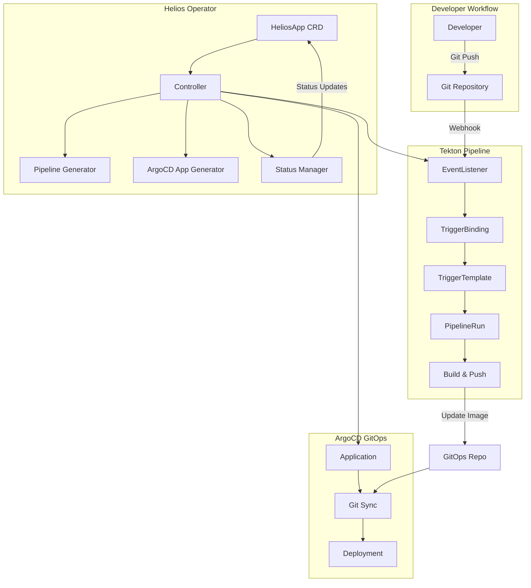
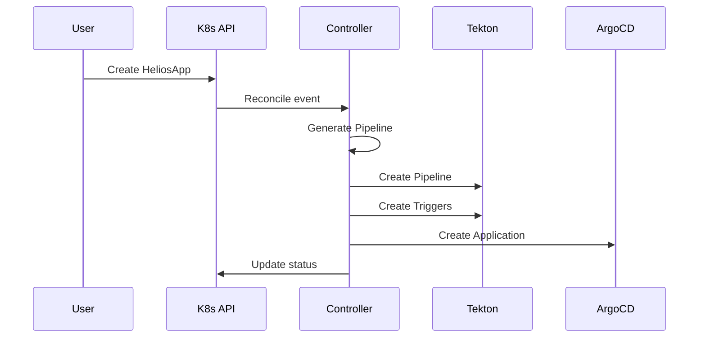
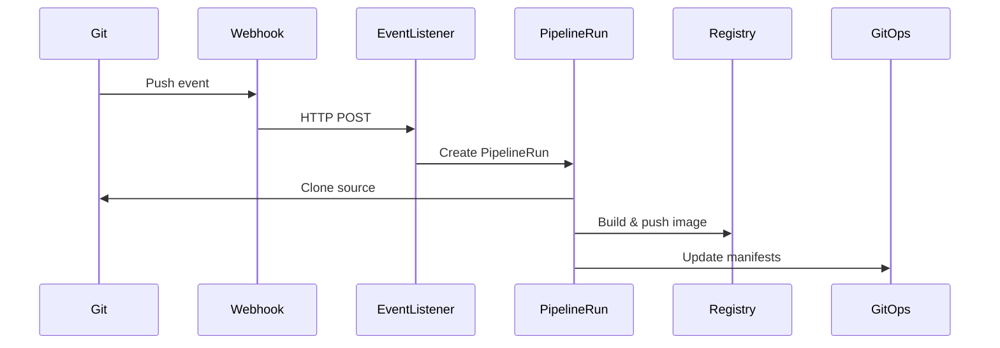
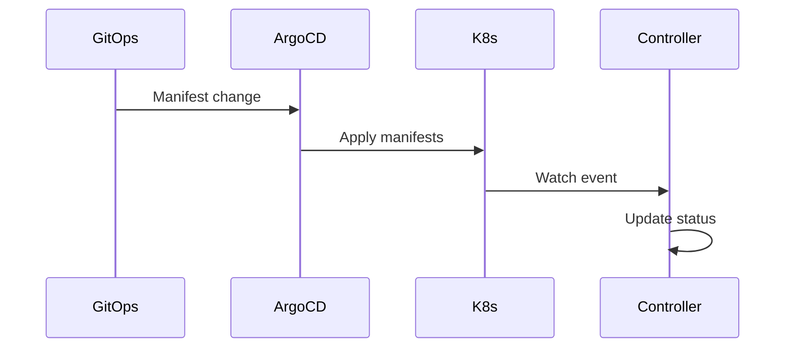

# 🏗️ Architecture Overview

This document provides a comprehensive overview of the Helios Operator architecture, system design, and component interactions.

## 🎯 **System Overview**

Helios Operator is a Kubernetes operator that orchestrates the complete application lifecycle from source code to production deployment using Tekton Pipelines and ArgoCD.



## 🧩 **Core Components**

### 1. **HeliosApp Custom Resource Definition (CRD)**

The central resource that defines an application deployment:

```yaml
apiVersion: platform.helios.io/v1
kind: HeliosApp
metadata:
  name: my-app
spec:
  gitRepo: "https://github.com/org/repo.git"
  imageRepo: "docker.io/org/app"
  # ... other fields
```

**Key Responsibilities**:

- Define application source and deployment configuration
- Trigger reconciliation when changes occur
- Store status and conditions

### 2. **Controller (Reconciler)**

The main controller that implements the reconciliation logic:

**Location**: `internal/controller/heliosapp_controller.go`

**Key Functions**:

- `Reconcile()` - Main reconciliation loop
- `SetupWithManager()` - Register watches and predicates
- Status management and condition updates

**Reconciliation Flow**:

1. Fetch HeliosApp resource
2. Generate and create Tekton Pipeline
3. Create Tekton Trigger resources (EventListener, TriggerBinding, TriggerTemplate)
4. Create ArgoCD Application
5. Update status with current state
6. Handle cleanup on deletion

### 3. **Pipeline Generator**

Automatically creates Tekton Pipelines from templates:

**Location**: `internal/controller/pipeline_resources.go`

**Key Functions**:

- `GeneratePipeline()` - Creates Pipeline from template
- `GenerateTriggerBinding()` - Creates TriggerBinding
- `GenerateTriggerTemplate()` - Creates TriggerTemplate

**Template-Based Approach**:

- Uses `tekton-pipeline-template.yaml` as base
- Customizes parameters for each application
- Ensures consistent Pipeline structure

### 4. **ArgoCD Application Generator**

Creates ArgoCD Applications for GitOps deployment:

**Location**: `internal/controller/argocd_resources.go`

**Key Functions**:

- `GenerateArgoApplication()` - Creates Application manifest
- Configures GitOps repository and path
- Sets up automated sync policies

### 5. **Status Manager**

Provides real-time status updates using Kubernetes Watches:

**Watch Targets**:

- ArgoCD Applications (sync status)
- Tekton PipelineRuns (build status)
- Kubernetes Deployments (health status)

**Status Fields**:

- `conditions` - Array of condition objects
- `deployedVersion` - Current deployed version
- `lastBuildStatus` - Last build result

## 🔄 **Data Flow**

### 1. **Application Creation Flow**



### 2. **Build Trigger Flow**



### 3. **Deployment Flow**



## 🎯 **Watch Architecture**

### Event-Driven Updates

Helios uses Kubernetes Watches to provide real-time status updates:

```go
// Watch ArgoCD Applications
ctrl.NewControllerManagedBy(mgr).
    For(&heliosappv1.HeliosApp{}).
    Watches(
        &source.Kind{Type: &unstructured.Unstructured{}},
        handler.EnqueueRequestsFromMapFunc(mapArgoAppToHeliosApp),
        builder.WithPredicates(predicate.GenerationChangedPredicate{}),
    ).
    Complete(r)
```

### Predicate Filtering

Only process relevant events:

```go
// Only watch ArgoCD Applications managed by this operator
func (r *HeliosAppReconciler) mapArgoAppToHeliosApp(obj client.Object) []reconcile.Request {
    labels := obj.GetLabels()
    if labels["helios.io/managed-by"] == "helios-operator" {
        return []reconcile.Request{{NamespacedName: types.NamespacedName{
            Name:      labels["helios.io/app-name"],
            Namespace: labels["helios.io/app-namespace"],
        }}}
    }
    return nil
}
```

### Cross-Namespace Tracking

Since ArgoCD Applications live in the `argocd` namespace but HeliosApps can be in any namespace, we use labels for tracking:

```go
labels := map[string]string{
    "helios.io/managed-by":    "helios-operator",
    "helios.io/app-name":      heliosApp.Name,
    "helios.io/app-namespace": heliosApp.Namespace,
}
```

## 🏗️ **Directory Structure**

```
helios-operator/
├── api/v1/                          # CRD definitions
│   ├── heliosapp_types.go          # HeliosApp CRD spec
│   ├── heliosapp_webhook.go        # Validation and defaulting
│   └── zz_generated.deepcopy.go    # Generated deepcopy methods
├── internal/controller/             # Controller implementation
│   ├── heliosapp_controller.go     # Main reconciliation logic
│   ├── pipeline_resources.go       # Pipeline generation
│   ├── argocd_resources.go         # ArgoCD Application generation
│   └── tekton_resources.go         # Tekton Trigger resources
├── config/                         # Kubernetes manifests
│   ├── crd/bases/                 # CRD definitions
│   ├── rbac/                      # RBAC configurations
│   └── samples/                   # Example resources
├── test/                          # Test files
│   ├── e2e/                       # End-to-end tests
│   └── utils/                     # Test utilities
└── helm/helios-operator/          # Helm chart
    ├── templates/                 # Kubernetes templates
    └── values.yaml               # Default values
```

## 🔧 **Configuration Management**

### Environment Variables

The operator supports configuration via environment variables:

```go
const (
    DefaultLogLevel = "info"
    DefaultLogFormat = "json"
)

func getLogLevel() string {
    if level := os.Getenv("LOG_LEVEL"); level != "" {
        return level
    }
    return DefaultLogLevel
}
```

### Feature Flags

Feature flags control optional functionality:

```go
type Features struct {
    AutoPipelineGeneration bool
    RealTimeStatusUpdates  bool
    WebhookValidation      bool
    MetricsCollection      bool
}
```

## 📊 **Metrics and Observability**

### Prometheus Metrics

The operator exposes several metrics:

```go
var (
    reconciliationDuration = prometheus.NewHistogramVec(
        prometheus.HistogramOpts{
            Name: "heliosapp_reconciliation_duration_seconds",
            Help: "Time spent reconciling HeliosApp",
        },
        []string{"name", "namespace"},
    )

    pipelineStatus = prometheus.NewCounterVec(
        prometheus.CounterOpts{
            Name: "heliosapp_pipeline_status_total",
            Help: "Total number of pipeline runs by status",
        },
        []string{"status", "app_name"},
    )
)
```

### Structured Logging

All logs use structured logging with key-value pairs:

```go
logger.Info("Starting reconciliation",
    "name", heliosApp.Name,
    "namespace", heliosApp.Namespace,
    "generation", heliosApp.Generation)
```

## 🛡️ **Security Architecture**

### RBAC (Role-Based Access Control)

The operator uses least-privilege RBAC:

```yaml
# ClusterRole permissions
rules:
  - apiGroups: ["platform.helios.io"]
    resources: ["heliosapps"]
    verbs: ["get", "list", "watch", "create", "update", "patch", "delete"]
  - apiGroups: ["tekton.dev"]
    resources: ["pipelines", "pipelineruns"]
    verbs: ["get", "list", "watch", "create", "update", "patch", "delete"]
  - apiGroups: ["argoproj.io"]
    resources: ["applications"]
    verbs: ["get", "list", "watch", "create", "update", "patch", "delete"]
```

### Pod Security Standards

The operator runs with restricted security context:

```yaml
securityContext:
  allowPrivilegeEscalation: false
  capabilities:
    drop: ["ALL"]
  readOnlyRootFilesystem: true
  runAsNonRoot: true
  runAsUser: 65532
```

### Webhook Security

Admission webhooks validate resources before creation:

```go
func (v *HeliosAppWebhook) ValidateCreate(ctx context.Context, obj runtime.Object) error {
    heliosApp := obj.(*heliosappv1.HeliosApp)

    // Validate required fields
    if heliosApp.Spec.GitRepo == "" {
        return errors.New("gitRepo is required")
    }

    // Validate URLs
    if !isValidURL(heliosApp.Spec.GitRepo) {
        return errors.New("invalid gitRepo URL")
    }

    return nil
}
```

## 🔄 **Error Handling and Resilience**

### Retry Logic

The controller implements exponential backoff for retries:

```go
func (r *HeliosAppReconciler) Reconcile(ctx context.Context, req ctrl.Request) (ctrl.Result, error) {
    // ... reconciliation logic ...

    if err != nil {
        if errors.IsConflict(err) {
            // Retry on conflict
            return ctrl.Result{Requeue: true}, nil
        }
        if errors.IsNotFound(err) {
            // Don't retry if resource not found
            return ctrl.Result{}, nil
        }
        // Other errors - retry with exponential backoff
        return ctrl.Result{RequeueAfter: time.Minute}, err
    }

    return ctrl.Result{}, nil
}
```

### Status Conditions

Status conditions provide clear error information:

```go
func (r *HeliosAppReconciler) updateStatus(ctx context.Context, heliosApp *heliosappv1.HeliosApp, conditionType string, status metav1.ConditionStatus, reason, message string) error {
    condition := metav1.Condition{
        Type:               conditionType,
        Status:             status,
        ObservedGeneration: heliosApp.Generation,
        LastTransitionTime: metav1.NewTime(time.Now()),
        Reason:             reason,
        Message:            message,
    }

    // Update or add condition
    meta.SetStatusCondition(&heliosApp.Status.Conditions, condition)
    return r.Status().Update(ctx, heliosApp)
}
```

## 🚀 **Performance Considerations**

### Resource Optimization

- **Object Reuse**: Reuse unstructured objects where possible
- **Batch Operations**: Group similar operations together
- **Selective Updates**: Only update resources when necessary

### Memory Management

```go
// Pre-allocate slice capacity
resources := make([]*unstructured.Unstructured, 0, 3)
resources = append(resources, eventListener, triggerBinding, triggerTemplate)

// Use object pools for frequently created objects
var objectPool = sync.Pool{
    New: func() interface{} {
        return &unstructured.Unstructured{}
    },
}
```

### Caching Strategy

The controller uses Kubernetes client caching:

```go
// Watch with cache
ctrl.NewControllerManagedBy(mgr).
    For(&heliosappv1.HeliosApp{}).
    Watches(&source.Kind{Type: &unstructured.Unstructured{}}, &handler.EnqueueRequestForObject{}).
    Complete(r)
```

## 🔮 **Future Enhancements**

### Planned Features

1. **Multi-Cluster Support**: Deploy to multiple Kubernetes clusters
2. **Advanced Pipeline Templates**: Support for multiple pipeline types
3. **Custom Resource Validation**: More sophisticated validation rules
4. **Metrics Dashboard**: Built-in monitoring dashboard
5. **Policy Engine**: Enforce deployment policies

### Extension Points

The architecture is designed for extensibility:

- **Custom Pipeline Templates**: Add new pipeline types
- **Additional Watches**: Monitor more resource types
- **Custom Status Fields**: Add application-specific status
- **Webhook Extensions**: Custom validation logic

---

**Ready to contribute?** Check out our [Development Setup Guide](02-development-setup.md) to get started! 🚀
