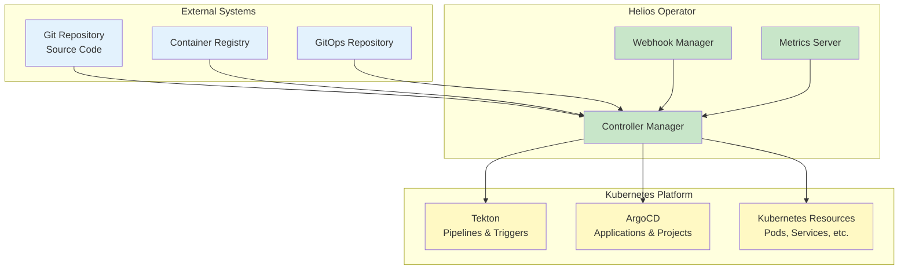
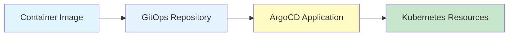
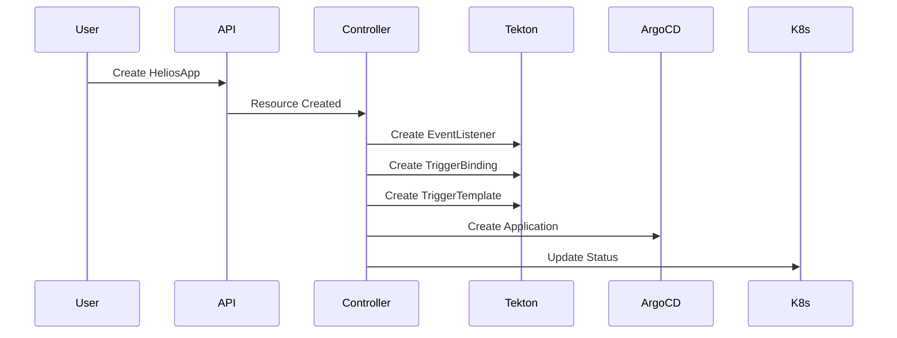
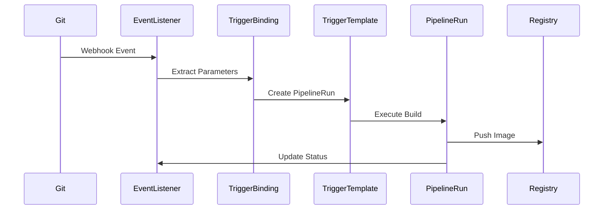
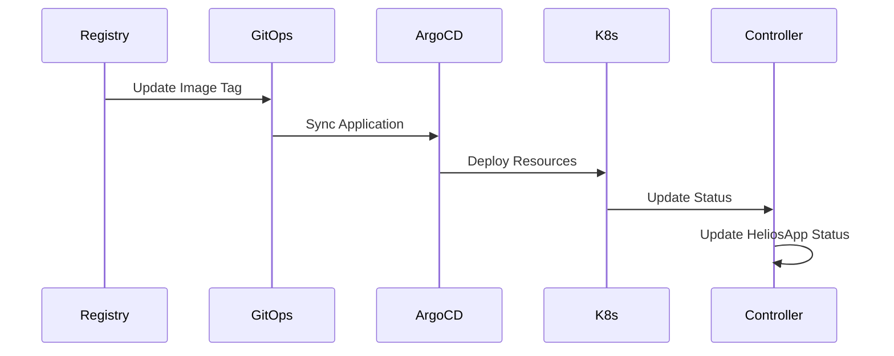

# Architecture Guide

This document provides a comprehensive overview of the Helios Operator architecture, including component interactions, data flow, and design decisions.

## Table of Contents

- [Overview](#overview)
- [Architecture Components](#architecture-components)
- [Data Flow](#data-flow)
- [Component Interactions](#component-interactions)
- [Design Principles](#design-principles)
- [Extension Points](#extension-points)

## Overview

Helios Operator is a Kubernetes operator that provides GitOps-based application lifecycle management. It integrates with Tekton for CI/CD pipelines and ArgoCD for GitOps-based deployments.

### High-Level Architecture



## Architecture Components

### 1. Helios Operator Core

The core operator consists of several key components:

#### Controller Manager

- **Purpose**: Manages the reconciliation loop for HeliosApp resources
- **Responsibilities**:
  - Watches for changes to HeliosApp resources
  - Coordinates with Tekton and ArgoCD
  - Updates resource status and conditions
  - Manages resource lifecycle

#### Webhook Manager

- **Purpose**: Provides admission control for HeliosApp resources
- **Responsibilities**:
  - Validates incoming HeliosApp resources
  - Ensures resource specifications are valid
  - Provides immediate feedback on configuration errors

#### Metrics Server

- **Purpose**: Exposes Prometheus metrics for monitoring
- **Responsibilities**:
  - Collects operational metrics
  - Provides health check endpoints
  - Enables monitoring and alerting

### 2. Tekton Integration

#### Pipeline Management

- **EventListeners**: Handle Git webhook events
- **TriggerBindings**: Extract parameters from webhook payloads
- **TriggerTemplates**: Define PipelineRun specifications
- **Pipelines**: Execute build and test processes

#### Build Process

```mermaid
graph LR
    GitPush[Git Push] --> Webhook[Webhook]
    Webhook --> EventListener[EventListener]
    EventListener --> TriggerBinding[TriggerBinding]
    TriggerBinding --> TriggerTemplate[TriggerTemplate]
    TriggerTemplate --> PipelineRun[PipelineRun]
    PipelineRun --> ContainerImage[Container Image]

    style GitPush fill:#e3f2fd
    style Webhook fill:#fff9c4
    style EventListener fill:#c8e6c9
    style TriggerBinding fill:#c8e6c9
    style TriggerTemplate fill:#c8e6c9
    style PipelineRun fill:#ffcdd2
    style ContainerImage fill:#e1f5fe
```



### 3. ArgoCD Integration

#### Application Management

- **ArgoCD Applications**: Manage GitOps-based deployments
- **Sync Policies**: Control automated synchronization
- **Health Monitoring**: Track application health status

#### Deployment Process



## Data Flow

### 1. Application Creation Flow



### 2. Build Trigger Flow



### 3. Deployment Flow



## Component Interactions

### 1. Controller Reconciliation Loop

The controller follows a structured reconciliation process:

```go
func (r *HeliosAppReconciler) Reconcile(ctx context.Context, req ctrl.Request) (ctrl.Result, error) {
    // 1. Fetch HeliosApp
    heliosApp := &heliosappv1.HeliosApp{}
    if err := r.Get(ctx, req.NamespacedName, heliosApp); err != nil {
        return ctrl.Result{}, client.IgnoreNotFound(err)
    }

    // 2. Handle deletion
    if !heliosApp.DeletionTimestamp.IsZero() {
        return r.handleDeletion(ctx, heliosApp)
    }

    // 3. Ensure finalizer
    if err := r.ensureFinalizer(ctx, heliosApp); err != nil {
        return ctrl.Result{}, err
    }

    // 4. Reconcile components
    if err := r.reconcileTektonResources(ctx, heliosApp); err != nil {
        return ctrl.Result{}, err
    }

    if err := r.reconcileArgoCDApplication(ctx, heliosApp); err != nil {
        return ctrl.Result{}, err
    }

    // 5. Update status
    if err := r.updateStatus(ctx, heliosApp); err != nil {
        return ctrl.Result{}, err
    }

    return ctrl.Result{RequeueAfter: r.config.ReconcileInterval}, nil
}
```

### 2. Status Management

The operator maintains comprehensive status information:

```go
type HeliosAppStatus struct {
    // Overall status
    Phase   string `json:"phase,omitempty"`
    Message string `json:"message,omitempty"`
    Reason  string `json:"reason,omitempty"`

    // Component statuses
    PipelineStatus   PipelineStatus   `json:"pipelineStatus,omitempty"`
    DeploymentStatus DeploymentStatus `json:"deploymentStatus,omitempty"`
    ArgoCDStatus     ArgoCDStatus     `json:"argocdStatus,omitempty"`

    // Conditions
    Conditions []metav1.Condition `json:"conditions,omitempty"`

    // Observed generation
    ObservedGeneration int64 `json:"observedGeneration,omitempty"`
}
```

### 3. Error Handling

The operator implements comprehensive error handling:

```go
func (r *HeliosAppReconciler) handleError(ctx context.Context, heliosApp *heliosappv1.HeliosApp, err error) (ctrl.Result, error) {
    // Log error
    r.Log.Error(err, "Reconciliation failed", "heliosapp", heliosApp.Name)

    // Update status
    condition := metav1.Condition{
        Type:    common.ConditionReady,
        Status:  metav1.ConditionFalse,
        Reason:  "ReconciliationFailed",
        Message: err.Error(),
    }
    meta.SetStatusCondition(&heliosApp.Status.Conditions, condition)

    // Check if error is transient
    if common.IsTransientError(err) {
        return ctrl.Result{RequeueAfter: r.config.RetryBackoff}, nil
    }

    // Permanent error - don't requeue
    return ctrl.Result{}, nil
}
```

## Design Principles

### 1. GitOps-First Approach

- **Single Source of Truth**: Git repositories serve as the authoritative source
- **Declarative Configuration**: All configurations are defined declaratively
- **Automated Synchronization**: Changes are automatically synchronized

### 2. Separation of Concerns

- **CI/CD Separation**: Build and deployment processes are separated
- **Component Isolation**: Each component has well-defined responsibilities
- **Interface-Based Design**: Components interact through well-defined interfaces

### 3. Observability

- **Comprehensive Logging**: All operations are logged with structured data
- **Metrics Collection**: Operational metrics are collected and exposed
- **Status Tracking**: Detailed status information is maintained

### 4. Extensibility

- **Plugin Architecture**: Support for custom pipeline templates
- **Webhook Integration**: Extensible webhook handling
- **Custom Resources**: Support for custom resource definitions

## Extension Points

### 1. Custom Pipeline Templates

Users can define custom pipeline templates:

```yaml
apiVersion: platform.helios.io/v1
kind: HeliosApp
metadata:
  name: custom-pipeline-app
spec:
  # ... standard configuration ...

  pipeline:
    template: "custom-build-pipeline"
    parameters:
      - name: "BUILD_ARGS"
        value: "--build-arg NODE_ENV=production"
      - name: "TEST_COMMAND"
        value: "npm run test:ci"
```

### 2. Custom ArgoCD Configuration

Users can customize ArgoCD application behavior:

```yaml
apiVersion: platform.helios.io/v1
kind: HeliosApp
metadata:
  name: custom-argocd-app
spec:
  # ... standard configuration ...

  argocd:
    project: "production"
    syncPolicy:
      automated:
        prune: true
        selfHeal: true
      syncOptions:
        - "CreateNamespace=true"
        - "PrunePropagationPolicy=foreground"
    retry:
      limit: 5
      backoff:
        duration: 5m
        factor: 2
        maxDuration: 3h
```

### 3. Custom Webhook Handlers

Users can implement custom webhook handling logic:

```go
type CustomWebhookHandler struct {
    client client.Client
    logger logr.Logger
}

func (h *CustomWebhookHandler) HandleWebhook(ctx context.Context, payload []byte) error {
    // Custom webhook processing logic
    return nil
}
```

## Security Considerations

### 1. RBAC

The operator implements least-privilege RBAC:

```yaml
apiVersion: rbac.authorization.k8s.io/v1
kind: ClusterRole
metadata:
  name: helios-operator-manager-role
rules:
  - apiGroups: ["platform.helios.io"]
    resources: ["heliosapps"]
    verbs: ["get", "list", "watch", "create", "update", "patch", "delete"]
  - apiGroups: ["platform.helios.io"]
    resources: ["heliosapps/status", "heliosapps/finalizers"]
    verbs: ["get", "update", "patch"]
```

### 2. Webhook Security

Webhooks are secured with TLS and authentication:

```yaml
apiVersion: admissionregistration.k8s.io/v1
kind: ValidatingAdmissionWebhook
metadata:
  name: heliosapp-validation.helios.io
webhooks:
  - name: heliosapp-validation.helios.io
    clientConfig:
      service:
        name: helios-operator-webhook-service
        namespace: helios-system
        path: "/validate-platform-helios-io-v1-heliosapp"
    rules:
      - operations: ["CREATE", "UPDATE"]
        apiGroups: ["platform.helios.io"]
        apiVersions: ["v1"]
        resources: ["heliosapps"]
    failurePolicy: Fail
    sideEffects: None
```

### 3. Secret Management

Sensitive data is managed through Kubernetes secrets:

```yaml
apiVersion: v1
kind: Secret
metadata:
  name: helios-app-secrets
type: Opaque
data:
  webhook-secret: <base64-encoded-secret>
  registry-credentials: <base64-encoded-credentials>
```

## Performance Considerations

### 1. Resource Efficiency

- **Minimal Resource Usage**: Operator uses minimal CPU and memory
- **Efficient Caching**: Kubernetes client caching is optimized
- **Batch Operations**: Multiple operations are batched where possible

### 2. Scalability

- **Horizontal Scaling**: Operator can be scaled horizontally
- **Concurrent Processing**: Multiple reconciliations can run concurrently
- **Resource Limits**: Appropriate resource limits are set

### 3. Monitoring

- **Performance Metrics**: Key performance metrics are exposed
- **Resource Usage**: Resource usage is monitored
- **Alerting**: Critical issues are alerted

## Future Enhancements

### 1. Multi-Cluster Support

- **Cluster Federation**: Support for multiple Kubernetes clusters
- **Cross-Cluster Deployment**: Deploy applications across clusters
- **Centralized Management**: Centralized management of multiple clusters

### 2. Advanced GitOps Features

- **Multi-Environment**: Enhanced multi-environment support
- **Promotion Workflows**: Automated promotion workflows
- **Rollback Capabilities**: Advanced rollback capabilities

### 3. Enhanced Monitoring

- **Distributed Tracing**: OpenTelemetry integration
- **Advanced Metrics**: More detailed operational metrics
- **Predictive Analytics**: AI-powered insights

This architecture guide provides a comprehensive understanding of the Helios Operator design and implementation. For more detailed information, see the [Development Setup](02-development-setup.md) guide.
