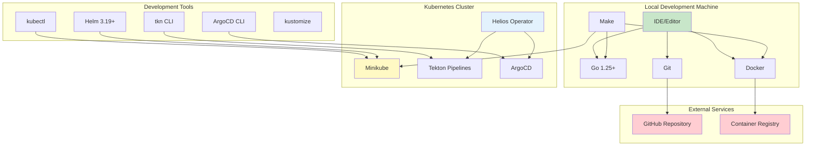

# ⚙️ Development Setup

This guide will help you set up a complete development environment for contributing to Helios Operator.

## 🏗️ **Development Environment Architecture**



## 📋 **Prerequisites**

### Required Tools

- **Go 1.25+** - [Download](https://golang.org/dl/)
- **Docker** - [Download](https://docs.docker.com/get-docker/)
- **kubectl** - [Download](https://kubernetes.io/docs/tasks/tools/)
- **Helm 3.19+** - [Download](https://helm.sh/docs/intro/install/)
- **Minikube** - [Download](https://minikube.sigs.k8s.io/docs/start/)
- **Git** - [Download](https://git-scm.com/downloads)

### Optional Tools

- **tkn CLI** - Tekton command line tool
- **ArgoCD CLI** - ArgoCD command line tool
- **kustomize** - Kubernetes configuration management
- **controller-gen** - Generate CRD and RBAC manifests

## 🚀 **Quick Setup**

### 1. Clone Repository

```bash
git clone https://github.com/hoangphuc841/helios-operator.git
cd helios-operator
```

### 2. Setup Development Environment

```bash
# Complete development setup (installs all tools and builds project)
make dev-setup

# Or install tools manually
make tools
```

### 3. Start Development Environment

```bash
# Start Minikube with sufficient resources
minikube start --memory=4096 --cpus=2 --driver=docker

# Enable required addons
minikube addons enable ingress
minikube addons enable metrics-server
```

## 🏗️ **Complete Development Environment**

### Step 1: Install Tekton Pipelines

```bash
# Install Tekton Pipelines
kubectl apply -f https://storage.googleapis.com/tekton-releases/pipeline/latest/release.yaml

# Install Tekton Triggers
kubectl apply -f https://storage.googleapis.com/tekton-releases/triggers/latest/release.yaml

# Wait for Tekton to be ready
kubectl wait --for=condition=ready pod -l app=tekton-pipelines-controller -n tekton-pipelines --timeout=300s
kubectl wait --for=condition=ready pod -l app.kubernetes.io/name=controller -n tekton-pipelines --timeout=300s

# Verify installation
kubectl get pods -n tekton-pipelines
```

### Step 2: Install ArgoCD

```bash
# Add ArgoCD Helm repository
helm repo add argo https://argoproj.github.io/argo-helm
helm repo update

# Create ArgoCD namespace
kubectl create namespace argocd

# Install ArgoCD
helm install argocd argo/argo-cd --namespace argocd

# Wait for ArgoCD to be ready
kubectl wait --for=condition=ready pod -l app.kubernetes.io/name=argocd-server -n argocd --timeout=300s

# Get initial admin password
kubectl get secret argocd-initial-admin-secret -n argocd -o jsonpath="{.data.password}" | base64 --decode && echo
```

### Step 3: Build and Deploy Operator

```bash
# Build operator image
make docker-build IMG=helios-operator:dev

# Load image into Minikube
minikube image load helios-operator:dev

# Install CRDs
make install

# Deploy operator
make deploy IMG=helios-operator:dev

# Verify operator is running
make status
```

### Step 4: Set up ArgoCD UI Access

```bash
# Port forward to ArgoCD UI
kubectl port-forward svc/argocd-server -n argocd 8080:443 &

# Access ArgoCD UI at: https://localhost:8080
# Username: admin
# Password: (from previous step)
```

## 🧪 **Testing Setup**

### Unit Tests

```bash
# Run all unit tests
make test

# Run tests with coverage
make test-coverage

# Run specific test package
go test ./internal/controller/... -v

# Run tests with race detection
go test -race ./...
```

### Integration Tests

```bash
# Run integration tests
make test-integration

# Run specific integration test
go test ./test/integration/... -v
```

### End-to-End Tests

```bash
# Run E2E tests for GitOps workflow
make test-e2e

# Run E2E tests with verbose output
go test -v ./test/e2e/... -timeout 30m
```

## 🔧 **Development Workflow**

### Local Development

```bash
# Run operator locally (outside cluster)
make run

# Run with specific log level
make run LOG_LEVEL=debug

# Run with development mode
make run DEV_MODE=true
```

### Code Generation

```bash
# Generate deepcopy methods and CRD manifests
make generate manifests

# Or run individually
make generate  # DeepCopy methods
make manifests # CRDs and RBAC
```

### Building and Testing

```bash
# Build operator binary
make build

# Build Docker image
make docker-build IMG=helios-operator:latest

# Run linting
make lint

# Run tests
make test

# Run tests with coverage
make test-coverage
```

## 🐛 **Debugging**

### Operator Logs

```bash
# View operator logs
kubectl logs -n system deployment/helios-operator -f

# View logs with timestamps
kubectl logs -n system deployment/helios-operator --timestamps=true

# View previous container logs
kubectl logs -n system deployment/helios-operator --previous
```

### Debug Mode

```bash
# Enable debug logging
kubectl patch deployment helios-operator -n system --type='merge' -p='{"spec":{"template":{"spec":{"containers":[{"name":"manager","env":[{"name":"LOG_LEVEL","value":"debug"}]}]}}}}'

# View debug logs
kubectl logs -n system deployment/helios-operator -f | grep DEBUG
```

### Resource Inspection

```bash
# Check CRD
kubectl get crd heliosapps.platform.helios.io

# Check RBAC
kubectl get clusterrole helios-operator-manager-role
kubectl get clusterrolebinding helios-operator-manager-rolebinding

# Check webhook configuration
kubectl get validatingwebhookconfiguration helios-operator-validating-webhook-configuration
kubectl get mutatingwebhookconfiguration helios-operator-mutating-webhook-configuration
```

## 🔄 **Hot Reload Development**

### Using Tilt (Recommended)

```bash
# Install Tilt
curl -fsSL https://raw.githubusercontent.com/tilt-dev/tilt/master/scripts/install.sh | bash

# Start Tilt
tilt up

# View Tilt UI
open http://localhost:10350
```

### Manual Hot Reload

```bash
# Watch for changes and rebuild
while inotifywait -e modify -r .; do
    make docker-build IMG=helios-operator:dev
    minikube image load helios-operator:dev
    kubectl rollout restart deployment/helios-operator -n system
done
```

## 📊 **Monitoring Development**

### Prometheus Metrics

```bash
# Port forward to metrics endpoint
kubectl port-forward -n system svc/helios-operator-metrics 8443:8443 &

# View metrics
curl -k https://localhost:8443/metrics
```

### Custom Metrics

```bash
# Check custom metrics
curl -k https://localhost:8443/metrics | grep heliosapp

# Monitor reconciliation duration
curl -k https://localhost:8443/metrics | grep reconciliation_duration
```

## 🧪 **Test Data Setup**

### Create Test Namespace

```bash
kubectl create namespace helios-apps
```

### Create Test Resources

```bash
# Create PVC for testing
kubectl apply -f - <<EOF
apiVersion: v1
kind: PersistentVolumeClaim
metadata:
  name: test-app-pvc
  namespace: helios-apps
spec:
  accessModes:
  - ReadWriteOnce
  resources:
    requests:
      storage: 1Gi
EOF

# Create ServiceAccount for testing
kubectl apply -f - <<EOF
apiVersion: v1
kind: ServiceAccount
metadata:
  name: pipeline-sa
  namespace: helios-apps
EOF
```

### Create Test HeliosApp

```bash
kubectl apply -f - <<EOF
apiVersion: platform.helios.io/v1
kind: HeliosApp
metadata:
  name: test-app
  namespace: helios-apps
spec:
  gitRepo: "https://github.com/hoangphuc841/helios.git"
  gitBranch: "main"
  gitopsRepo: "https://github.com/PhuocHoan/helios-gitops.git"
  gitopsPath: "test-app"
  gitopsBranch: "main"
  imageRepo: "docker.io/test/test-app"
  port: 80
  replicas: 1
  serviceAccount: "pipeline-sa"
  webhookSecret: "test-webhook-secret"
  pvcName: "test-app-pvc"
EOF
```

## 🚀 **Performance Testing**

### Load Testing

```bash
# Create multiple HeliosApps for load testing
for i in {1..10}; do
  kubectl apply -f - <<EOF
apiVersion: platform.helios.io/v1
kind: HeliosApp
metadata:
  name: load-test-app-$i
  namespace: helios-apps
spec:
  gitRepo: "https://github.com/hoangphuc841/helios.git"
  imageRepo: "docker.io/test/load-test-app-$i"
  serviceAccount: "pipeline-sa"
  webhookSecret: "test-webhook-secret"
  pvcName: "test-app-pvc"
EOF
done
```

### Memory Profiling

```bash
# Enable memory profiling
kubectl patch deployment helios-operator -n system --type='merge' -p='{"spec":{"template":{"spec":{"containers":[{"name":"manager","env":[{"name":"ENABLE_PROFILING","value":"true"}]}]}}}}'

# Access profiling endpoint
kubectl port-forward -n system deployment/helios-operator 6060:6060
curl http://localhost:6060/debug/pprof/heap
```

## 🔧 **IDE Configuration**

### VS Code

Create `.vscode/settings.json`:

```json
{
  "go.toolsManagement.checkForUpdates": "local",
  "go.useLanguageServer": true,
  "go.lintTool": "golangci-lint",
  "go.lintFlags": ["--fast"],
  "go.testFlags": ["-v"],
  "go.buildTags": "integration",
  "go.testTimeout": "30m"
}
```

### GoLand/IntelliJ

1. Enable Go modules support
2. Set Go SDK to 1.25+
3. Configure Run/Debug configurations for tests
4. Enable Kubernetes plugin for YAML support

## 🧹 **Cleanup**

### Clean Development Environment

```bash
# Stop operator
make undeploy

# Remove CRDs
make uninstall

# Delete test resources
kubectl delete namespace helios-apps

# Stop Minikube
minikube stop
```

### Clean Build Artifacts

```bash
# Clean build artifacts
make clean

# Remove Docker images
docker rmi helios-operator:dev
docker rmi helios-operator:latest

# Clean Go module cache
go clean -modcache
```

## 🆘 **Troubleshooting**

### Common Issues

#### Minikube Issues

```bash
# Reset Minikube if corrupted
minikube delete
minikube start --memory=4096 --cpus=2

# Check Minikube status
minikube status
minikube logs
```

#### Docker Issues

```bash
# Restart Docker daemon
sudo systemctl restart docker

# Check Docker status
docker info
docker version
```

#### Go Module Issues

```bash
# Clean module cache
go clean -modcache

# Re-download modules
go mod download
go mod tidy
```

#### Kubernetes Issues

```bash
# Check cluster status
kubectl cluster-info
kubectl get nodes

# Check system pods
kubectl get pods -n kube-system
```

## 📚 **Additional Resources**

### Documentation

- [Kubebuilder Documentation](https://book.kubebuilder.io/)
- [Controller Runtime Documentation](https://pkg.go.dev/sigs.k8s.io/controller-runtime)
- [Tekton Documentation](https://tekton.dev/docs/)
- [ArgoCD Documentation](https://argo-cd.readthedocs.io/)

### Tools

- [Kubebuilder CLI](https://kubebuilder.io/quick-start.html)
- [Controller Gen](https://pkg.go.dev/sigs.k8s.io/controller-tools/cmd/controller-gen)
- [Kustomize](https://kustomize.io/)

---

**Ready to start coding?** Check out our [Testing Guide](03-testing.md) to learn about our testing strategies! 🧪
