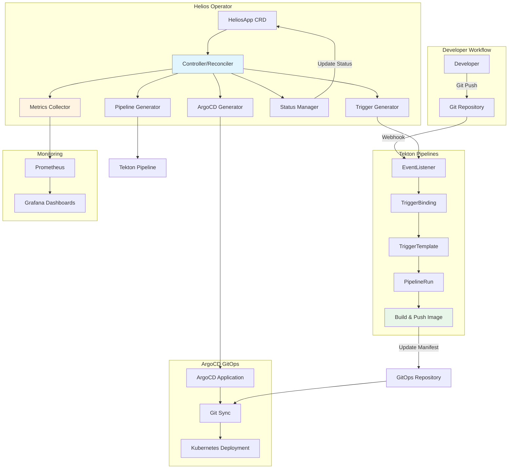
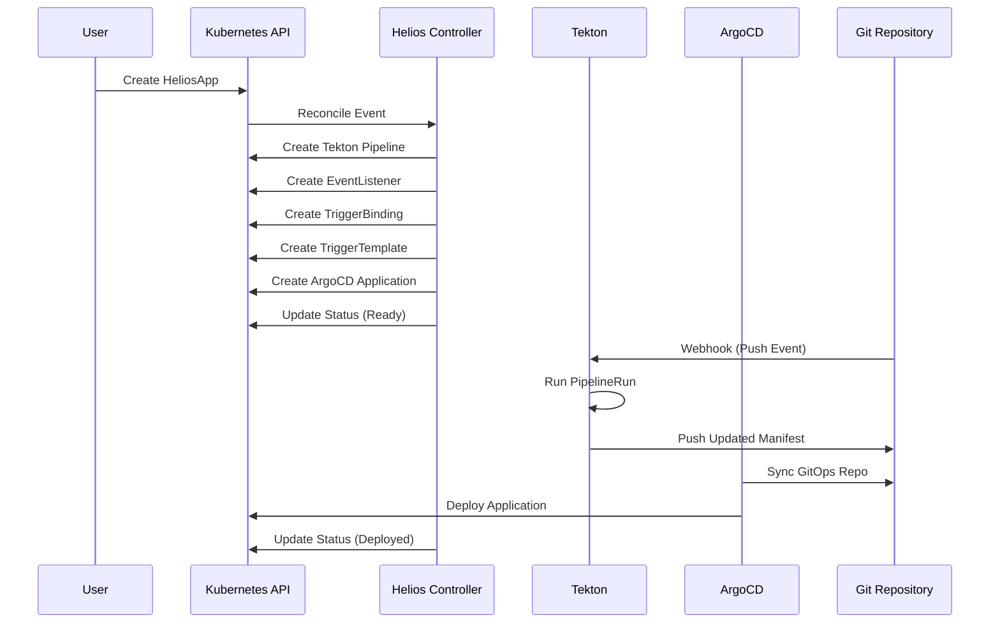
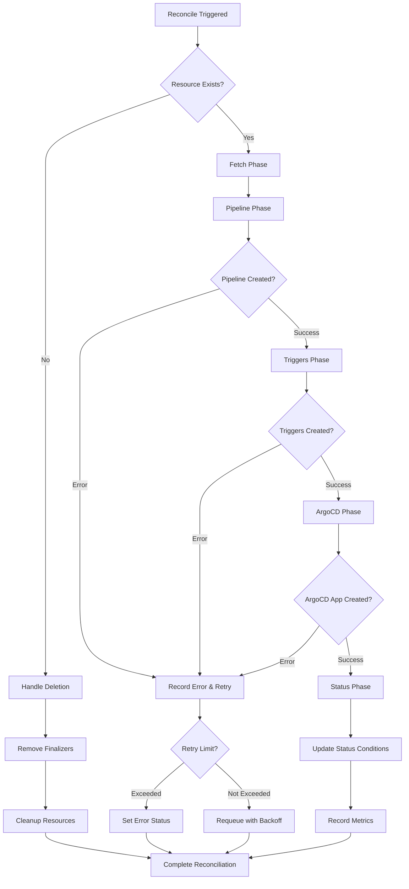
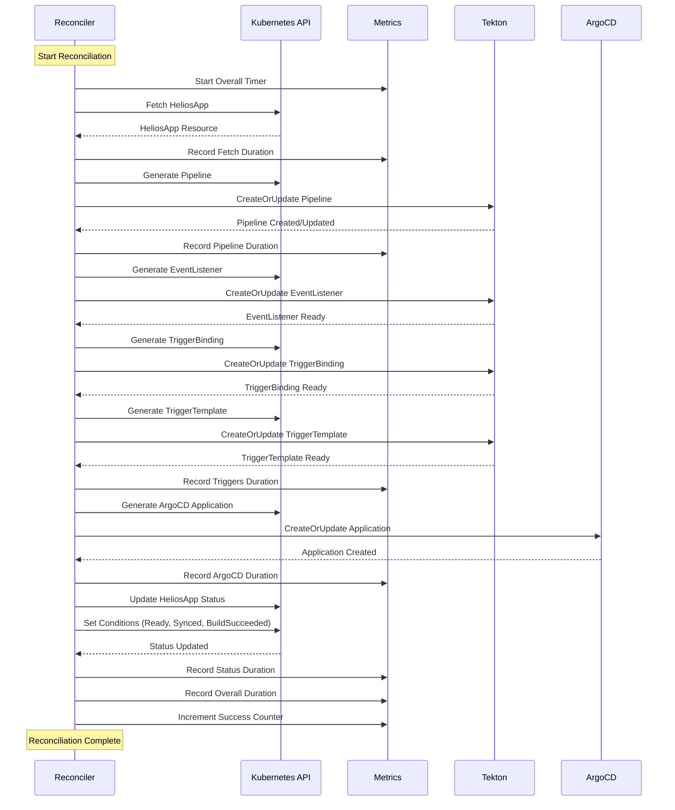
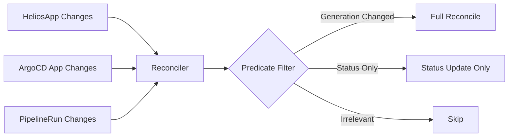

# 🏗️ Helios Operator Architecture

This document provides a comprehensive overview of the Helios Operator architecture, components, and design decisions.

## Table of Contents

1. [Overview](#overview)
2. [High-Level Architecture](#high-level-architecture)
3. [Core Components](#core-components)
4. [Reconciliation Flow](#reconciliation-flow)
5. [Metrics and Observability](#metrics-and-observability)
6. [Configuration](#configuration)
7. [Security](#security)
8. [Testing Strategy](#testing-strategy)

## Overview

Helios Operator is a Kubernetes operator that provides a simplified interface for deploying applications using GitOps. It orchestrates Tekton Pipelines for CI/CD and ArgoCD Applications for continuous deployment, abstracting away the complexity of managing these tools directly.

**Key Features:**
- Declarative application deployment via HeliosApp CRD
- Automated CI/CD pipeline creation with Tekton
- GitOps-based deployment with ArgoCD
- Comprehensive metrics and observability
- Webhook-based Git integration
- Extensive validation and error handling

## High-Level Architecture

### System Overview



### Component Interaction



## Core Components

### 1. HeliosApp Controller

**Location:** `internal/controller/heliosapp_controller.go`

The main reconciliation controller that manages the entire lifecycle of HeliosApp resources.

**Key Responsibilities:**
- Fetch and validate HeliosApp resources
- Reconcile Tekton Pipelines
- Reconcile Tekton Triggers (EventListener, TriggerBinding, TriggerTemplate)
- Reconcile ArgoCD Applications
- Update comprehensive status with build and deployment information

**Reconciliation Phases:**
1. **Fetch Phase**: Retrieve HeliosApp resource from cluster
2. **Pipeline Phase**: Create/update Tekton Pipeline
3. **Triggers Phase**: Create/update webhook triggers
4. **ArgoCD Phase**: Create/update ArgoCD Application
5. **Status Phase**: Update status with build and deployment health

### 2. Resource Generators

**Location:** `internal/resources/`

Modules responsible for generating Kubernetes resources:

- **`argocd.go`**: ArgoCD Application resource generation
- **`tekton.go`**: Tekton Pipeline resource generation  
- **`pipeline.go`**: Pipeline task definitions

**Key Functions:**
- Template-based resource generation
- Parameter substitution
- Ownership reference management

### 3. Webhook Validation

**Location:** `api/v1/heliosapp_webhook.go`

Admission webhook for validating HeliosApp resources before they're created or updated.

**Validations:**
- Git URL format and scheme validation
- Container image repository format
- Port range (1-65535)
- Replica limits (0-100)
- Immutable field enforcement (gitRepo, imageRepo)
- Update impact warnings

### 4. Metrics System

**Location:** `internal/controller/metrics.go`

Comprehensive Prometheus metrics for observability.

**Metric Categories:**

**Reconciliation Metrics:**
- `heliosapp_reconciliation_duration_seconds`: Overall reconciliation duration
- `heliosapp_reconciliation_phase_duration_seconds`: Per-phase duration
- `heliosapp_reconciliations_total`: Total reconciliation count
- `heliosapp_reconciliation_errors_total`: Errors by type and phase

**Build Metrics:**
- `heliosapp_builds_total`: Build count by status
- `heliosapp_argocd_sync_status`: ArgoCD sync status

**Health Metrics:**
- `heliosapp_deployment_health`: Deployment health status
- `heliosapp_replicas`: Replica counts (desired vs ready)

**API Metrics:**
- `heliosapp_api_calls_total`: Kubernetes API call count
- `heliosapp_api_call_duration_seconds`: API call latency

**Webhook Metrics:**
- `heliosapp_webhook_validations_total`: Validation attempts
- `heliosapp_webhook_validation_duration_seconds`: Validation duration

### 5. Health Checks

**Location:** `internal/health/health.go`

Health check endpoints for Kubernetes probes.

**Endpoints:**
- `/healthz`: Liveness probe (process responsiveness)
- `/readyz`: Readiness probe (API connectivity, webhook status)

**Checks:**
- Kubernetes API server connectivity
- Webhook certificate validity
- Leader election status

### 6. Configuration Management

**Location:** `internal/config/config.go`

Centralized configuration management with environment variable support.

**Configuration Options:**
- Reconciliation settings (interval, concurrency)
- Resource defaults (replicas, port, service account)
- Retry settings (max retries, backoff)
- Feature flags (metrics, webhooks, leader election)
- Timeouts (reconciliation, API calls)

## Reconciliation Flow

### High-Level Reconciliation Process



### Detailed Reconciliation Phases



### Phase Breakdown

1. **Fetch Phase** (`fetch`)
   - Retrieve HeliosApp resource from Kubernetes API
   - Return if resource not found (deletion case)
   - Log fetch errors with context

2. **Pipeline Phase** (`pipeline`)
   - Generate Tekton Pipeline from template
   - Apply owner references
   - CreateOrUpdate Pipeline resource
   - Handle pipeline creation errors

3. **Triggers Phase** (`triggers`)
   - Generate EventListener for webhook reception
   - Generate TriggerBinding for parameter extraction
   - Generate TriggerTemplate for PipelineRun instantiation
   - CreateOrUpdate all trigger resources
   - Handle trigger creation errors

4. **ArgoCD Phase** (`argocd`)
   - Generate ArgoCD Application manifest
   - Configure GitOps repository sync
   - Apply sync policy and health checks
   - CreateOrUpdate Application resource
   - Handle ArgoCD errors

5. **Status Phase** (`status`)
   - Query ArgoCD Application sync status
   - Query latest Tekton PipelineRun status
   - Calculate deployment health
   - Update HeliosApp status conditions:
     - `Ready`: Overall health
     - `Synced`: ArgoCD sync status
     - `BuildSucceeded`: Last build status
   - Update status fields (deployedVersion, lastBuild, etc.)

### Watch Configuration


                      │
                      ▼
┌─────────────────────────────────────────────────────────────┐
│ 5. Triggers Phase (Phase Timer: "triggers")                │
│    - Generate EventListener                                 │
│    - Generate TriggerBinding                                │
│    - Generate TriggerTemplate                               │
│    - CreateOrUpdate each resource                           │
│    - Record trigger errors                                  │
└─────────────────────┬───────────────────────────────────────┘
                      │
                      ▼
┌─────────────────────────────────────────────────────────────┐
│ 6. ArgoCD Phase (Phase Timer: "argocd")                    │
│    - Generate ArgoCD Application                            │
│    - CreateOrUpdate Application                             │
│    - Record ArgoCD errors                                   │
└─────────────────────┬───────────────────────────────────────┘
                      │
                      ▼
┌─────────────────────────────────────────────────────────────┐
│ 7. Status Phase (Phase Timer: "status")                    │
│    - Get latest PipelineRun status                          │
│    - Get Deployment health                                  │
│    - Get ArgoCD sync/health status                          │
│    - Update HeliosApp.Status                                │
│    - Record status update errors                            │
└─────────────────────┬───────────────────────────────────────┘
                      │
                      ▼
┌─────────────────────────────────────────────────────────────┐
│ 8. Complete                                                  │
│    - Stop all phase timers                                  │
│    - Record overall duration                                │
│    - Update last reconcile timestamp                        │
│    - Log completion with duration                           │
└─────────────────────────────────────────────────────────────┘
```

### Watch Triggers

The controller watches multiple resource types for changes:

**Primary Resource:**
- `HeliosApp`: Direct changes trigger reconciliation

**Secondary Resources (with predicates):**
- `ArgoCD Application`: Changes to sync/health status
- `Tekton PipelineRun`: Build completion or failure
- `Deployment`: Pod readiness changes

**Predicate Filtering:**
Each watch includes predicates to reduce unnecessary reconciliations:
- ArgoCD: Only apps with managed-by label
- PipelineRun: Only runs with app label
- Deployment: Only deployments with app label

## Metrics and Observability

### Prometheus Integration

All metrics are automatically registered with the controller-runtime metrics registry and exposed on the `/metrics` endpoint (default port 8443).

### Grafana Dashboards

Recommended dashboard panels:

1. **Reconciliation Performance**
   - Average reconciliation duration
   - P95/P99 reconciliation latency
   - Phase-by-phase breakdown

2. **Error Rates**
   - Errors by phase
   - Error rate over time
   - Error types distribution

3. **Application Health**
   - Deployment health by application
   - ArgoCD sync status
   - Build success rate

4. **Resource Metrics**
   - Managed resources count
   - API call rate and latency
   - Webhook validation performance

## Configuration

### Environment Variables

```bash
# Reconciliation Settings
RECONCILE_INTERVAL=5m
MAX_CONCURRENT_RECONCILES=3

# Resource Defaults
DEFAULT_REPLICAS=1
DEFAULT_PORT=8080
DEFAULT_SERVICE_ACCOUNT=default

# Retry Settings
MAX_RETRIES=3
RETRY_BACKOFF=30s

# Feature Flags
ENABLE_METRICS=true
ENABLE_WEBHOOKS=true
ENABLE_LEADER_ELECTION=true

# Timeouts
RECONCILE_TIMEOUT=10m
API_CALL_TIMEOUT=30s

# Namespace Watching
WATCH_NAMESPACE=  # Empty = all namespaces
```

### ConfigMap Support

Configuration can also be loaded from a ConfigMap (future enhancement).

## Security

### RBAC

The operator requires specific permissions:

**Core Permissions:**
- HeliosApp resources: Full access
- Tekton resources: Full access (Pipelines, PipelineRuns, Triggers)
- ArgoCD resources: Full access (Applications)
- Deployments: Read access for status

**Webhook Permissions:**
- ValidatingWebhookConfiguration: Update for webhook setup

### Pod Security

- Runs with non-root user
- Read-only root filesystem
- Dropped capabilities
- Resource limits enforced

### Admission Control

Webhook validation prevents:
- Invalid Git URLs
- Malformed image repositories
- Out-of-range ports or replicas
- Modification of immutable fields

## Error Handling

### Custom Error Types

**Location:** `internal/common/errors.go`

- `ReconciliationError`: General reconciliation failures
- `ResourceGenerationError`: Resource generation issues
- `ValidationError`: Validation failures
- `StatusUpdateError`: Status update problems

All errors support wrapping with `Unwrap()` for error chain inspection.

### Retry Strategy

- Exponential backoff with jitter
- Configurable max retries
- Phase-specific error handling
- Automatic requeue on transient failures

## Testing

### Unit Tests

- Controller logic tests
- Resource generation tests
- Validation tests
- Metrics tests

### Integration Tests

- envtest for Kubernetes API simulation
- Full reconciliation workflow tests
- Watch predicate tests

### Coverage Target

- Minimum 80% code coverage
- Critical paths: 100% coverage

## Future Enhancements

1. **Multi-Tenancy**: Namespace isolation and resource quotas
2. **Custom Builders**: Support for different build tools (Maven, Gradle, etc.)
3. **Canary Deployments**: Progressive delivery with ArgoCD Rollouts
4. **Cost Optimization**: Resource recommendations and auto-scaling
5. **Backup/Restore**: HeliosApp resource backup and disaster recovery
