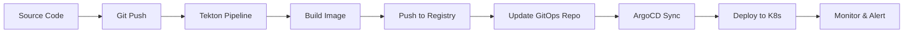
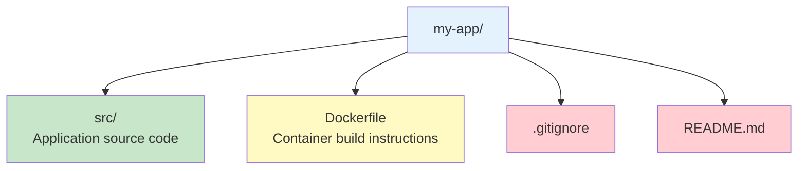
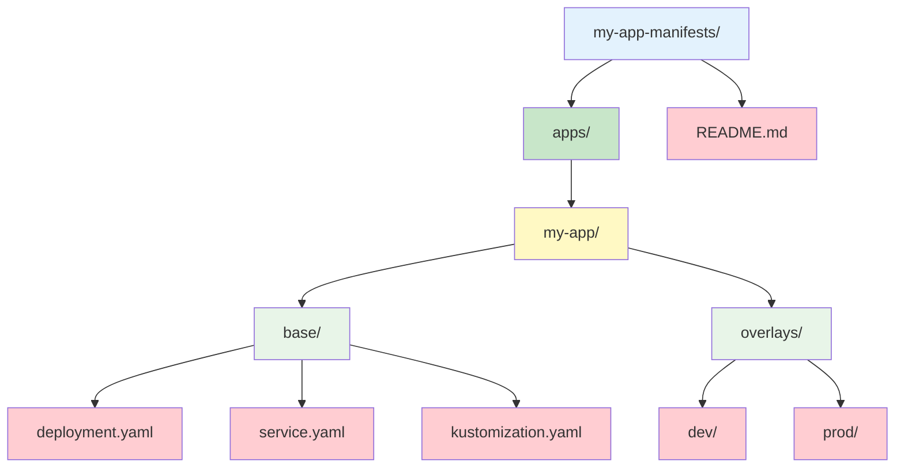

# Getting Started with Helios Operator

Welcome to Helios Operator, a comprehensive GitOps-based application lifecycle management solution for Kubernetes. This guide will walk you through the complete workflow from source code to production deployment.

> **🚧 PoC Project**: This is currently a Proof of Concept (PoC) project. The operator is not yet published to official package repositories. You need to clone the repository and install locally.

## 🚀 What is Helios Operator?

Helios Operator automates the entire application lifecycle by:

- **Building** your application from source code using Tekton Pipelines
- **Deploying** your application using ArgoCD GitOps
- **Monitoring** your application health and performance
- **Managing** the complete CI/CD pipeline through Kubernetes custom resources

## 📋 Complete Workflow Overview



## Table of Contents

- [Prerequisites](#prerequisites)
- [Installation](#installation)
- [Complete Workflow Walkthrough](#complete-workflow-walkthrough)
- [Verification & Monitoring](#verification--monitoring)
- [Troubleshooting](#troubleshooting)
- [Next Steps](#next-steps)

## Prerequisites

Before installing Helios Operator, ensure you have the following prerequisites:

> **📋 Important**: Since this is a PoC project, you must clone the repository locally before installation.

### Kubernetes Cluster

- **Kubernetes version**: 1.25 or later
- **Cluster access**: kubectl configured to access your cluster
- **Permissions**: Cluster admin or sufficient RBAC permissions

### Required Components

The following components must be installed in your cluster:

1. **ArgoCD**

```bash
kubectl create namespace argocd
kubectl apply -n argocd -f https://raw.githubusercontent.com/argoproj/argo-cd/stable/manifests/install.yaml
```

2. **Tekton Pipelines, Tekton Triggers**

```bash
kubectl apply --filename https://storage.googleapis.com/tekton-releases/pipeline/latest/release.yaml
kubectl apply --filename https://storage.googleapis.com/tekton-releases/triggers/latest/release.yaml
```

### Optional Components

- **cert-manager**: For webhook certificate management
- **Prometheus**: For metrics collection
- **Grafana**: For monitoring dashboards

## Installation

### Method 1: Using Helm (Recommended)

1. **Clone the repository**:

```bash
git clone https://github.com/hoangphuc841/helios-operator.git
cd helios-operator
```

2. **Install using Helm**:

```bash
helm install helios-operator ./helm/helios-operator \
  --namespace helios-system \
  --create-namespace \
  --set config.watchNamespace="" \
  --set config.enableMetrics=true \
  --set config.enableWebhooks=true
```

### Method 2: Using Kustomize

1. **Clone the repository**:

```bash
git clone https://github.com/hoangphuc841/helios-operator.git
cd helios-operator
```

2. **Install the operator**:

```bash
kubectl apply -k config/default
```

## Complete Workflow Walkthrough

Let's walk through the complete workflow from source code to production deployment using a real example.

### Prerequisites Setup

Before we start, ensure you have:

1. **Two GitHub repositories**:

   - Source code repository (your application)
   - GitOps repository (Kubernetes manifests)

2. **Container registry access** (Docker Hub, GitHub Container Registry, etc.)

3. **Webhook access** to your source repository

### Step 1: Prepare Your Repositories

#### Source Code Repository Structure

Your application repository should have:



#### GitOps Repository Structure

Your GitOps repository can start **empty** or with basic manifests. The operator will work with whatever manifests you provide.

**Option 1: Start with Empty Repository**

```
my-app-manifests/
└── (empty - operator will work with manifests you add later)
```

**Option 2: Pre-populated Structure (Recommended)**



> **💡 Note**: If your GitOps repository is empty, you'll need to create basic manifests (deployment.yaml, service.yaml) manually. The operator will then automatically update image tags when new builds are available.

### Step 2: Create Basic GitOps Manifests (if needed)

If your GitOps repository is empty, create basic manifests:

#### Create `deployment.yaml`:

```yaml
apiVersion: apps/v1
kind: Deployment
metadata:
  name: my-sample-app
  labels:
    app: my-sample-app
spec:
  replicas: 2
  selector:
    matchLabels:
      app: my-sample-app
  template:
    metadata:
      labels:
        app: my-sample-app
    spec:
      containers:
        - name: app
          image: your-registry.com/my-app:latest # This will be updated by operator
          ports:
            - containerPort: 8080
          resources:
            requests:
              memory: "64Mi"
              cpu: "250m"
            limits:
              memory: "128Mi"
              cpu: "500m"
```

#### Create `service.yaml`:

```yaml
apiVersion: v1
kind: Service
metadata:
  name: my-sample-app-service
  labels:
    app: my-sample-app
spec:
  selector:
    app: my-sample-app
  ports:
    - port: 8080
      targetPort: 8080
      protocol: TCP
  type: ClusterIP
```

#### Create `kustomization.yaml`:

```yaml
apiVersion: kustomize.config.k8s.io/v1beta1
kind: Kustomization

resources:
  - deployment.yaml
  - service.yaml

commonLabels:
  app.kubernetes.io/name: my-sample-app
  app.kubernetes.io/managed-by: helios-operator
```

### Step 3: Create Your First HeliosApp

Create a file named `my-app.yaml`:

```yaml
apiVersion: platform.helios.io/v1
kind: HeliosApp
metadata:
  name: my-sample-app
  namespace: default
spec:
  # Source repository
  gitRepo: "https://github.com/your-username/my-app"

  # Container image repository
  imageRepo: "your-registry.com/my-app"

  # Application port
  port: 8080

  # Webhook secret
  webhookSecret: "my-webhook-secret"

  # GitOps repository
  gitopsRepo: "https://github.com/your-username/my-app-manifests"
  gitopsPath: "apps/my-app"
```

### Step 4: Create Required Secrets

#### Webhook Secret

```bash
# Create webhook secret for Git triggers
kubectl create secret generic my-webhook-secret \
  --from-literal=webhook-secret-key="your-webhook-secret-here" \
  --namespace=default
```

#### Container Registry Secret (if using private registry)

```bash
# Create registry secret
kubectl create secret docker-registry regcred \
  --docker-server=your-registry.com \
  --docker-username=your-username \
  --docker-password=your-password \
  --docker-email=your-email@example.com \
  --namespace=default
```

### Step 5: Apply the HeliosApp Configuration

```bash
# Apply the HeliosApp resource
kubectl apply -f my-app.yaml

# Verify the resource was created
kubectl get heliosapps
kubectl describe heliosapp my-sample-app
```

### Step 6: Monitor the Initial Reconciliation

```bash
# Watch the HeliosApp status
kubectl get heliosapps -w

# Check detailed status and conditions
kubectl describe heliosapp my-sample-app

# View events related to your app
kubectl get events --field-selector involvedObject.name=my-sample-app --sort-by='.lastTimestamp'

# Check operator logs for reconciliation details
kubectl logs -n helios-system deployment/helios-operator-manager -f
```

### Step 7: Verify Created Resources

The operator will create several resources automatically:

#### Tekton Resources

```bash
# Check EventListener (Git webhook receiver)
kubectl get eventlisteners
kubectl describe eventlistener helios-my-sample-app

# Check TriggerBinding and TriggerTemplate
kubectl get triggerbindings,triggertemplates

# Check for any PipelineRuns (will appear after Git push)
kubectl get pipelineruns
```

#### ArgoCD Resources

```bash
# Check ArgoCD Application
kubectl get applications -n argocd
kubectl describe application my-sample-app -n argocd

# Check ArgoCD sync status
kubectl get applications -n argocd my-sample-app -o jsonpath='{.status.sync.status}'
```

### Step 8: Trigger the Complete Workflow

Now let's trigger the complete CI/CD pipeline:

#### Make a Change to Your Source Code

```bash
# Clone your source repository
git clone https://github.com/your-username/my-app.git
cd my-app

# Make a change (e.g., update README)
echo "Updated via Helios Operator" >> README.md

# Commit and push the change
git add README.md
git commit -m "Trigger Helios Operator pipeline"
git push origin main
```

#### Monitor the Pipeline Execution

```bash
# Watch for new PipelineRun creation
kubectl get pipelineruns -w

# Check the latest PipelineRun status
kubectl get pipelineruns --sort-by='.metadata.creationTimestamp' | tail -1

# Get detailed PipelineRun information
kubectl describe pipelinerun <pipeline-run-name>

# Watch PipelineRun logs
kubectl logs -l tekton.dev/pipelineRun=<pipeline-run-name> --all-containers=true -f
```

### Step 9: Verify Deployment

#### Check Image Build and Push

```bash
# Verify the image was built and pushed to registry
# (Check your container registry for the new image)

# Check PipelineRun completion
kubectl get pipelineruns -l app.kubernetes.io/name=my-sample-app

# The operator automatically updates the image tag in your GitOps repository
# Check your GitOps repo for the updated deployment.yaml with new image tag
```

#### Check ArgoCD Sync

```bash
# Verify ArgoCD detected the changes
kubectl get applications -n argocd my-sample-app -o jsonpath='{.status.sync.status}'

# Force sync if needed
argocd app sync my-sample-app --server argocd.your-domain.com

# Check application health
kubectl get applications -n argocd my-sample-app -o jsonpath='{.status.health.status}'
```

#### Check Application Deployment

```bash
# Verify pods are running
kubectl get pods -l app=my-sample-app

# Check service
kubectl get svc -l app=my-sample-app

# Check ingress (if configured)
kubectl get ingress -l app=my-sample-app

# Test application access
kubectl port-forward svc/my-sample-app-service 8080:8080
curl http://localhost:8080
```

### Step 10: Monitor Application Health

```bash
# Check application logs
kubectl logs -l app=my-sample-app -f

# Monitor resource usage
kubectl top pods -l app=my-sample-app

# Check for any issues
kubectl describe pods -l app=my-sample-app
```

## Verification & Monitoring

### 🔍 Complete Health Check

#### 1. Operator Health Verification

```bash
# Check operator pod status
kubectl get pods -n helios-system -l app.kubernetes.io/name=helios-operator

# Verify operator is ready
kubectl get pods -n helios-system -l app.kubernetes.io/name=helios-operator -o jsonpath='{.items[0].status.conditions[?(@.type=="Ready")].status}'

# Check operator logs for any errors
kubectl logs -n helios-system deployment/helios-operator-manager --tail=50

# Verify CRD is installed and accessible
kubectl get crd heliosapps.platform.helios.io -o yaml
```

#### 2. HeliosApp Resource Status

```bash
# Check all HeliosApps and their status
kubectl get heliosapps -o wide

# Get detailed status with conditions
kubectl get heliosapps my-sample-app -o yaml | grep -A 10 "status:"

# Check reconciliation status
kubectl describe heliosapp my-sample-app | grep -A 5 "Status:"
```

#### 3. Tekton Pipeline Health

```bash
# Check EventListener status (Git webhook receiver)
kubectl get eventlisteners -o wide
kubectl describe eventlistener helios-my-sample-app

# Check TriggerBindings and TriggerTemplates
kubectl get triggerbindings,triggertemplates -l app.kubernetes.io/name=my-sample-app

# Check recent PipelineRuns
kubectl get pipelineruns -l app.kubernetes.io/name=my-sample-app --sort-by='.metadata.creationTimestamp'

# Check PipelineRun success rate
kubectl get pipelineruns -l app.kubernetes.io/name=my-sample-app -o jsonpath='{range .items[*]}{.metadata.name}{"\t"}{.status.conditions[0].reason}{"\n"}{end}'
```

#### 4. ArgoCD Application Health

```bash
# Check ArgoCD Application status
kubectl get applications -n argocd my-sample-app -o yaml | grep -A 5 "status:"

# Check sync status
kubectl get applications -n argocd my-sample-app -o jsonpath='{.status.sync.status}'

# Check health status
kubectl get applications -n argocd my-sample-app -o jsonpath='{.status.health.status}'

# Check last sync time
kubectl get applications -n argocd my-sample-app -o jsonpath='{.status.sync.lastSyncedAt}'
```

#### 5. Application Deployment Health

```bash
# Check pod status and readiness
kubectl get pods -l app=my-sample-app -o wide

# Check service endpoints
kubectl get endpoints -l app=my-sample-app

# Check ingress status (if configured)
kubectl get ingress -l app=my-sample-app

# Verify application is responding
kubectl port-forward svc/my-sample-app-service 8080:8080 &
curl -f http://localhost:8080/health || echo "Health check failed"
kill %1
```

### 📊 Monitoring Dashboard

#### Prometheus Metrics

```bash
# Port forward to access metrics
kubectl port-forward -n helios-system svc/helios-operator-metrics 8080:8080

# Check operator metrics
curl http://localhost:8080/metrics | grep helios_operator

# Check reconciliation metrics
curl http://localhost:8080/metrics | grep reconciliation
```

#### Grafana Dashboard

If you have Grafana installed:

```bash
# Access Grafana (adjust URL based on your setup)
kubectl port-forward -n monitoring svc/grafana 3000:80

# Open http://localhost:3000 in your browser
# Import the Helios Operator dashboard from config/base/monitoring/grafana-dashboard.json
```

### 🚨 Health Check Script

Create a comprehensive health check script:

```bash
#!/bin/bash
# save as health-check.sh

echo "🔍 Helios Operator Health Check"
echo "================================"

# Check operator
echo "1. Checking Operator Health..."
if kubectl get pods -n helios-system -l app.kubernetes.io/name=helios-operator | grep -q "Running"; then
    echo "✅ Operator is running"
else
    echo "❌ Operator is not running"
fi

# Check CRD
echo "2. Checking CRD Installation..."
if kubectl get crd heliosapps.platform.helios.io > /dev/null 2>&1; then
    echo "✅ CRD is installed"
else
    echo "❌ CRD is not installed"
fi

# Check HeliosApps
echo "3. Checking HeliosApps..."
helios_count=$(kubectl get heliosapps --no-headers | wc -l)
echo "📊 Found $helios_count HeliosApp(s)"

# Check ArgoCD Applications
echo "4. Checking ArgoCD Applications..."
argocd_count=$(kubectl get applications -n argocd --no-headers | wc -l)
echo "📊 Found $argocd_count ArgoCD Application(s)"

# Check Tekton EventListeners
echo "5. Checking Tekton EventListeners..."
tekton_count=$(kubectl get eventlisteners --no-headers | wc -l)
echo "📊 Found $tekton_count EventListener(s)"

echo "================================"
echo "Health check complete!"
```

Make it executable and run:

```bash
chmod +x health-check.sh
./health-check.sh
```

## Troubleshooting

### Common Issues

#### 1. Operator Pod Not Starting

**Symptoms**: Operator pod is in CrashLoopBackOff or Pending state.

**Solutions**:

- Check resource quotas: `kubectl describe quota -n helios-system`
- Verify RBAC permissions: `kubectl auth can-i create heliosapps --as=system:serviceaccount:helios-system:helios-operator-manager`
- Check logs: `kubectl logs -n helios-system deployment/helios-operator-manager`

#### 2. ArgoCD Application Not Created

**Symptoms**: HeliosApp shows "ArgoCD Application not found" in status.

**Solutions**:

- Verify ArgoCD is running: `kubectl get pods -n argocd`
- Check ArgoCD namespace configuration
- Verify GitOps repository access permissions

#### 3. Tekton Pipeline Not Triggering

**Symptoms**: No PipelineRuns created after Git push.

**Solutions**:

- Check EventListener status: `kubectl get eventlisteners`
- Verify webhook secret configuration
- Check Tekton Triggers logs: `kubectl logs -n tekton-pipelines deployment/tekton-triggers-controller`

#### 4. Build Failures

**Symptoms**: PipelineRuns fail with build errors.

**Solutions**:

- Verify container registry credentials
- Check Dockerfile in source repository
- Review PipelineRun logs: `kubectl logs -l tekton.dev/pipelineRun=<pipeline-run-name>`

### Debug Commands

```bash
# Get detailed HeliosApp information
kubectl get heliosapp <app-name> -o yaml

# Check operator metrics (if enabled)
kubectl port-forward -n helios-system svc/helios-operator-metrics 8080:8080

# View all events
kubectl get events --sort-by='.lastTimestamp'

# Check resource usage
kubectl top pods -n helios-system
```

## Next Steps

Congratulations! You've successfully set up Helios Operator and deployed your first application. Here's what you can do next:

### 🚀 Immediate Next Steps

1. **Verify Your Deployment**: Run the health check script to ensure everything is working correctly
2. **Test the Complete Workflow**: Make another change to your source code and watch the pipeline execute
3. **Monitor Your Application**: Set up monitoring dashboards and alerts

### 📚 Learning Path

#### Beginner Level

1. **[Configuration Guide](02-configuration.md)** - Master all configuration options
2. **[Examples](../examples/)** - Explore ready-to-use examples
3. **[HeliosApp Specification](03-helios-app-spec.md)** - Understand the complete API reference

#### Intermediate Level

4. **[Troubleshooting Guide](04-troubleshooting.md)** - Learn to diagnose and fix issues
5. **[Examples Guide](05-examples.md)** - Advanced scenarios and real-world configurations
6. **[Monitoring Guide](06-monitoring.md)** - Set up comprehensive observability

#### Advanced Level

7. **Multi-Environment Setup** - Deploy across dev/staging/production
8. **Security Hardening** - Implement RBAC, network policies, and security scanning
9. **Custom Pipelines** - Create custom Tekton pipelines for specific needs
10. **GitOps Best Practices** - Implement proper GitOps workflows

### 🏗️ Production Readiness Checklist

- [ ] **Security**: Configure RBAC, network policies, and image scanning
- [ ] **Monitoring**: Set up Prometheus, Grafana, and alerting rules
- [ ] **Backup**: Configure backup for ArgoCD and Tekton resources
- [ ] **Multi-Environment**: Set up separate environments (dev/staging/prod)
- [ ] **CI/CD Pipeline**: Integrate with your existing CI/CD tools
- [ ] **Resource Management**: Configure resource limits and requests
- [ ] **High Availability**: Set up multiple replicas and leader election
- [ ] **Disaster Recovery**: Plan for cluster failures and data recovery

### 🔧 Advanced Workflows

#### Multi-Environment Deployment

```yaml
# Example: Deploy to multiple environments
apiVersion: platform.helios.io/v1
kind: HeliosApp
metadata:
  name: my-app-dev
spec:
  # ... configuration ...
  gitopsPath: "apps/my-app/overlays/dev"

---
apiVersion: platform.helios.io/v1
kind: HeliosApp
metadata:
  name: my-app-prod
spec:
  # ... configuration ...
  gitopsPath: "apps/my-app/overlays/prod"
  replicas: 3 # Higher replicas for production
```

#### Custom Pipeline Configuration

```yaml
spec:
  pipeline:
    enabled: true
    buildArgs:
      - "BUILD_ENV=production"
      - "NODE_ENV=production"
    context: "./src"
    dockerfile: "./Dockerfile.prod"
    resources:
      requests:
        memory: "2Gi"
        cpu: "1000m"
      limits:
        memory: "4Gi"
        cpu: "2000m"
```

### 📖 Additional Resources

#### Documentation

- **[Configuration Guide](02-configuration.md)** - Complete configuration reference
- **[HeliosApp Specification](03-helios-app-spec.md)** - API reference and field descriptions
- **[Troubleshooting Guide](04-troubleshooting.md)** - Common issues and solutions
- **[Examples Guide](05-examples.md)** - Advanced examples and scenarios
- **[Monitoring Guide](06-monitoring.md)** - Observability and metrics

#### External Resources

- **[ArgoCD Documentation](https://argo-cd.readthedocs.io/)** - GitOps deployment tool
- **[Tekton Documentation](https://tekton.dev/)** - CI/CD pipeline framework
- **[Kubernetes Documentation](https://kubernetes.io/docs/)** - Container orchestration platform

### 🆘 Support & Community

#### Getting Help

1. **Check the Documentation**: Review the guides above for detailed information
2. **Search Issues**: Look through existing [GitHub issues](https://github.com/hoangphuc841/helios-operator/issues)
3. **Create an Issue**: Report bugs or request features with detailed information
4. **Community Discussions**: Join discussions in GitHub Discussions

#### Contributing

- **Bug Reports**: Help us improve by reporting issues
- **Feature Requests**: Suggest new features and improvements
- **Code Contributions**: Contribute to the codebase
- **Documentation**: Help improve the documentation

#### Enterprise Support

> **Note**: This is a PoC project. For enterprise support, advanced features, or consulting services, please contact the Helios team or contribute to the project development.

---

## 🎉 Congratulations!

You've successfully:

- ✅ Installed and configured Helios Operator
- ✅ Deployed your first application using GitOps
- ✅ Set up automated CI/CD pipelines
- ✅ Monitored your application health

You're now ready to leverage the full power of GitOps-based application lifecycle management with Helios Operator!
